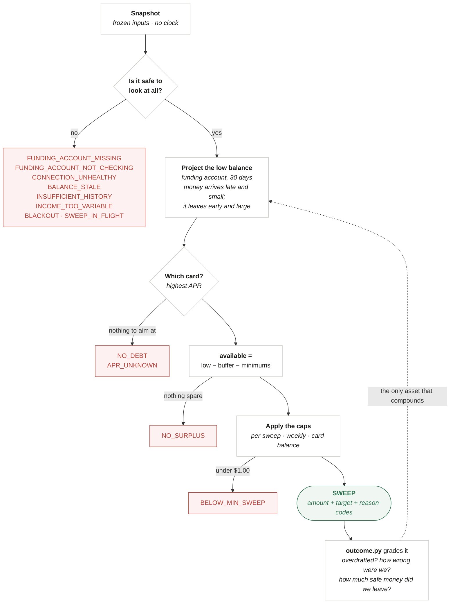

# cfo-ai

Working repo for a product thesis: **autonomous debt paydown** — every day, move the cash
a household genuinely doesn't need onto the debt that costs them the most, and be right
about "doesn't need."


```
python3 -m pytest tests/ -q      # the suite is the spec; it runs in well under a second
```

---

## `engine/` — the decision

The only code here, and deliberately so. Given a frozen snapshot of a household's cash
position, decide whether it is safe to move money to a card — **and usually decide that
it is not.**

Read the diagram by its **shape**. The spine is short. Almost everything branches *off* it,
into a reason to do nothing.



**Every red box is the product working.** Days with no sweep are not failures.

A richer, annotated version of this — with the full worst-case table and the calibration loop —
lives at [`docs/decision-flow.html`](docs/decision-flow.html). GitHub renders `.html` from a
private repo as source, so open it locally: `open docs/decision-flow.html`.

| File | What it does |
| --- | --- |
| `models.py` | Value types. Money is `Decimal`, dates are inputs, everything is frozen — and the types **refuse to exist** when the data is incoherent. |
| `forecast.py` | The conservative projection: *money arrives late and small; it leaves early and large.* |
| `decide.py` | The refusal gates, the buffer, the reserved minimums, the caps, the target card. Emits `Reason` **codes**, never sentences. |
| `interest.py` | What the debt costs and what a sweep saves — measured against what the household *was already paying*, never against the card minimum. |
| `outcome.py` | Grades a decision against what actually happened. Until this existed, nothing ever told the engine whether it was right. |
| `explain.py` | The only file with copy in it. A wording change can't break a financial calculation. |
| `../tests/` | Adversarial tests. **These are the spec.** |

**Why this and nothing else.** Moving money is a commodity (Plaid, Dwolla, bill-pay all
do it). Forecasting is hard but tractable. The thing that decides whether the company
lives is *knowing when not to act* — every sweep is a draw from a distribution, and the
downside of a wrong one ($35 fee, a bounced rent check, a customer gone forever) dwarfs
the upside of a right one (a few dollars of interest). You cannot win this on expected
value. You win it on the tail.

So the engine is deterministic — no clock, no network, no LLM, no randomness. The same
snapshot yields the same decision forever, which is what makes a sweep explainable to a
customer, auditable to a regulator, and replayable in a backtest after Plaid rewrites the
underlying history beneath you.

Four ideas carry it:

**Only the funding account protects you.** An ACH debit leaves *one* account. A household
with $100 in checking and $5,000 in savings has $5,100 of money and **$100 of
protection** — summing them and testing the total against the buffer authorises a sweep
that overdraws checking while the savings sits untouched. Savings is real, but it isn't
*there*.

**Bad data must never buy a bigger sweep.** `money()` rejects floats (`Decimal(2.675)`
quantizes to 2.67). `CashEvent` rejects mis-signed bounds, which would let an outflow hide
its own worst case. `Debt` rejects a negative `minimum_payment`, which would shrink the
reserve and hand the user a *larger* sweep. Incoherent input fails loudly at the boundary
rather than becoming someone's overdraft.

**Reasons are codes, not sentences.** The LLM narrates *from* `ReasonCode` and its
parameters — it is never handed a finished financial claim to paraphrase, and it is never
in the decision path. Copy lives in exactly one file, so an edit to it can't change what
the engine does.

**We never claim a number we can't stand behind.** "That's $31 of interest you won't pay"
is measured against what the household *was already paying* — not against the card minimum,
which would credit our sweep with interest they were never going to pay anyway and inflate
the one metric the company reports on itself. And when there's no honest figure — the issuer
doesn't report the APR, or we haven't yet seen what they pay, or their payments don't even
cover their interest — the engine emits **no claim at all**. The absence is structural: the
claim is a `Reason` like any other, so there is no code path that can render an invented
number.

Most of the code is reasons to do nothing. That's the feature.

Design notes and the deliberately-unbuilt parts: [`docs/decision-engine.md`](docs/decision-engine.md).

---

## `sim/` — the answer key

A deterministic household generator. Given a spec and a seed it produces a `History`: every
transaction a household made, and therefore the exact daily balance they actually had.

**This is the ground truth the engine is not allowed to see.** It exists because
[`prd.md`](docs/prd.md) §8 puts exactly one thing in the *Now* column — run the engine in
**shadow mode**, move nothing, and check what we *would* have swept against what actually
happened — and you cannot grade a forecast against a future you don't know. It is a
simulation, not a product surface; nothing in `engine/` imports it.

Two properties do the work. `(spec, seed)` yields a byte-identical history **forever** — a
backtest whose ground truth moves is not a backtest. And `History.as_of(day)` **slices**
rather than regenerates, so a snapshot built for day *T* can only contain what was knowable
on day *T*. That's the guard against lookahead bias, which is the classic way a backtest
reports a tail risk that is flattering and false.

Spend is modelled zero-inflated and right-skewed, not Gaussian, because real discretionary
spending is many $0 days and the occasional $400 one — and the entire calibration question is
about its **tail**.

**The first thing it found.** The generator was built partly to *kill* a claim I'd made about
the forecast. It didn't. `forecast.py` charges a **p90 of daily spend on all 30 horizon days**,
but variance grows with √t, not t. Measured against three years of each household's own
enumerated 30-day windows, the engine reserves **more than the household has ever spent in
three years** — over-reserving $400–$970 against a p99 month, versus a $750 default buffer. On
many days that single error is the whole difference between sweeping and refusing.

It fails *safe* — nobody is overdrawn — which is exactly why it would have survived
indefinitely. It is **deliberately not fixed**: the fix loosens the forecast and buys bigger
sweeps, and that must not happen before there's a grader to measure the breach rate. Write-up:
[`docs/learnings/2026-07-13-the-spend-model-over-reserves.md`](docs/learnings/2026-07-13-the-spend-model-over-reserves.md).

---

## `docs/` — the thinking

### The live product argument

| Doc | Why it exists |
| --- | --- |
| [`prd.md`](docs/prd.md) | What we'd build. Autonomous from day one; refusal and an overdraft guarantee as the load-bearing features. |
| [`strategy.md`](docs/strategy.md) | Why it's a business. We sell insurance, not information — and what compounds is calibration, not data. |
| [`decision-engine.md`](docs/decision-engine.md) | How the engine decides, and the four things it knowingly assumes away. |
| [`architecture.md`](docs/architecture.md) | The system around the engine, and what it deliberately doesn't build. The load-bearing choice is an append-only decision log that stores each decision's entire frozen input. |

### The evidence

| Doc | Why it exists |
| --- | --- |
| [`reviews/2026-07-12-prd-adversarial-review.md`](docs/reviews/2026-07-12-prd-adversarial-review.md) | Seven independent reviewers against the original drafts — premise, product, feasibility, security, scope, coherence, and external prior art. This is the document that changed everything. |

Two findings did the damage, and both are sourced there:

- **A >40,000-person field RCT** (Guttman-Kenney, Adams, Hunt, Laibson, Stewart & Leary,
  *AEJ: Econ Policy* 2025) changed what cardholders *chose* and, seven months later, had
  changed nothing about what they *owed*. **Advice does not move debt.**
- **Tally** raised ~$172M, reached an $855M valuation, and shut down in August 2024 — on
  customer acquisition cost, by its founder's own account. LendingClub bought the consumer
  app; **Pagaya bought the B2B platform.**

### The archive

| Doc | Why it's still here |
| --- | --- |
| [`archive/prd-v0-advice-only.md`](docs/archive/prd-v0-advice-only.md) | The original: recommend a number, let the user pay it, automate later once trust is earned. |
| [`archive/strategy-v0-trust-ladder.md`](docs/archive/strategy-v0-trust-ladder.md) | The original wedge argument: debt → automation → autonomous banking. |

Kept, not deleted. The RCT says the first rung of that ladder holds no weight — an advice
product can't earn trust by working, because it doesn't work. **Automation isn't the
reward for trust; automation is the product, and trust is the constraint you engineer
around.** That reversal is the whole point, and it's only legible if you can see what it
reversed.

---

## Status

- Only `engine/` and `sim/` exist. `architecture.md` is intent, not description.
- The engine can now be **graded** (`engine/outcome.py`), but not yet **replayed** — the
  shadow-mode driver is the last missing piece.
- Engine thresholds (`INCOME_CONFIDENCE_FLOOR`, `MAX_INCOME_VARIATION`,
  `MAX_BALANCE_AGE_DAYS`) are **judgment, not evidence**. The honest way to set them is
  shadow mode: run against real households, move nothing, measure how often the realized
  low balance fell below the projection, and set the thresholds from the observed tail.
  `sim/` is the first half of that; the grader and the replay driver are the rest, and
  until they exist **the engine has never once been told whether it was right.**
- Distribution and monetization are **named as unanswered**, not solved. They're what
  killed Tally, and pretending otherwise would be the one thing that discredits the rest.
