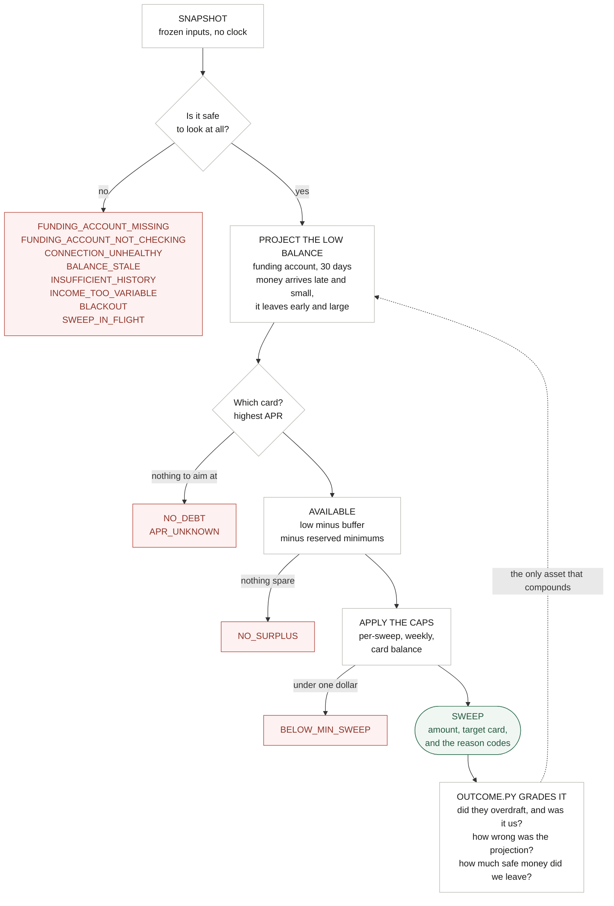

# cfo-ai

**An app that pays down high-interest debt with the cash a household wasn't using — and is
right about "wasn't using."**

Connect checking, savings, and cards once. From then on the system forecasts the near-term cash
position, decides what is genuinely surplus, and moves it onto the balance that costs the most.
The household does nothing. They are told what happened and why.

> *"You had $220 sitting idle in checking, so I moved it to your card. That's $31 of interest you
> won't pay."*

The promise is not "we help you pay off debt faster." It is: **you no longer have to choose between
paying down debt and being safe** — [`prd.md`](docs/prd.md) §1.

**We watch daily. We move weekly.** Two different things, and the distinction is load-bearing. The
forecast runs every day and a held day is still graded; the cadence limits what we *do*, never what
we *know*. Every sweep is an independent draw from a tail we cannot afford, so how many draws we
take is a risk lever as directly as how large any one of them is — and daily sweeping was a fossil
of an advice product nobody ever re-argued (`prd.md` §2.4).

**No payment rail is chosen, and nothing in the codebase assumes one.** ACH, a bill-pay partner, a
deep-link handoff, an FBO account via a banking partner — moving money is a commodity, and the
choice is foreclosed by a distribution question nobody has answered yet (`prd.md` §6.1, §7.1). The
engine emits a `Decision`; something else moves the money. That is a decision, not a gap.

**And no money has ever moved.** No Plaid link, no live balances, no rail, no real auth — nothing
here has touched a real household. `prd.md` §8 puts exactly one thing in the *Now* column:
**shadow mode** — run the engine, move nothing, and check what we *would* have swept against what
actually happened. That machinery is built and has run against 60 synthetic households. The shadow
itself has not. See **Status**, below.

| | |
|---|---|
| `engine/` | The decision — and usually the refusal. Pure, deterministic, zero dependencies. |
| `sim/` | The answer key: synthetic households whose true daily balance we know. |
| `backend/` | The walk, the grader, the population calibration, the API, Postgres. |
| `mobile/` | The surface: the decision feed, the spending view, the explanation. |
| *the rail* | **Deliberately unbuilt** — see above. |

```bash
.venv/bin/python -m pytest       # the suite is the spec
```

The database suites need a real Postgres and skip loudly without one — RLS and declarative
partitioning are the subject, so a SQLite stand-in would test a different artifact and report
green. Setup, and the two traps in it, are in
[`docs/runbooks/local-development.md`](docs/runbooks/local-development.md).

---

## `engine/` — the decision

Given a frozen snapshot of a household's cash position, decide whether it is safe to move money
to a card — **and usually decide that it is not.**

Pure. No clock, no network, no LLM, no randomness, and `dependencies = []`. Everything else in
this repo is a consumer of it.

Read the diagram by its **shape**. The spine is short. Almost everything branches *off* it,
into a reason to do nothing.



**Every red box is the product working.** Days with no sweep are not failures.

A richer, annotated version of this — with the full worst-case table and the calibration loop —
lives at [`docs/decision-flow.html`](docs/decision-flow.html). GitHub renders `.html` from a
private repo as source, so open it locally: `open docs/decision-flow.html`.

| File | What it does |
| --- | --- |
| `models.py` | Value types. Money is `Decimal`, dates are inputs, everything is frozen — and the types **refuse to exist** when the data is incoherent. |
| `forecast.py` | The conservative projection: *money arrives late and small; it leaves early and large.* |
| `decide.py` | The refusal gates, the buffer, the reserved minimums, the caps, the target card. Emits `Reason` **codes**, never sentences. |
| `interest.py` | What the debt costs and what a sweep saves — measured against what the household *was already paying*, never against the card minimum. |
| `outcome.py` | Grades a decision against what actually happened. Until this existed, nothing ever told the engine whether it was right. |
| `explain.py` | The only file with copy in it. A wording change can't break a financial calculation. |
| `../tests/` | Adversarial tests. **These are the spec.** |

**Why the engine is the bet.** Moving money is a commodity (Plaid, Dwolla, bill-pay all
do it). Forecasting is hard but tractable. The thing that decides whether the company
lives is *knowing when not to act* — every sweep is a draw from a distribution, and the
downside of a wrong one ($35 fee, a bounced rent check, a customer gone forever) dwarfs
the upside of a right one (a few dollars of interest). You cannot win this on expected
value. You win it on the tail.

So the engine is deterministic — no clock, no network, no LLM, no randomness. The same
snapshot yields the same decision forever, which is what makes a sweep explainable to a
customer, auditable to a regulator, and replayable in a backtest after Plaid rewrites the
underlying history beneath you.

Four ideas carry it:

**Only the funding account protects you.** An ACH debit leaves *one* account. A household
with $100 in checking and $5,000 in savings has $5,100 of money and **$100 of
protection** — summing them and testing the total against the buffer authorises a sweep
that overdraws checking while the savings sits untouched. Savings is real, but it isn't
*there*.

**Bad data must never buy a bigger sweep.** `money()` rejects floats (`Decimal(2.675)`
quantizes to 2.67). `CashEvent` rejects mis-signed bounds, which would let an outflow hide
its own worst case. `Debt` rejects a negative `minimum_payment`, which would shrink the
reserve and hand the user a *larger* sweep. Incoherent input fails loudly at the boundary
rather than becoming someone's overdraft.

**Reasons are codes, not sentences.** The LLM narrates *from* `ReasonCode` and its
parameters — it is never handed a finished financial claim to paraphrase, and it is never
in the decision path. Copy lives in exactly one file, so an edit to it can't change what
the engine does.

**We never claim a number we can't stand behind.** "That's $31 of interest you won't pay"
is measured against what the household *was already paying* — not against the card minimum,
which would credit our sweep with interest they were never going to pay anyway and inflate
the one metric the company reports on itself. And when there's no honest figure — we haven't
yet seen what they pay, or their payments don't even cover their interest — the engine emits
**no claim at all**. The absence is structural: the claim is a `Reason` like any other, so there
is no code path that can render an invented number.

The sharpest case is a missing APR. Plaid doesn't report one for many issuers, so the engine
**estimates it at 23% and ranks on the estimate** — a wrong target optimizes worse but overdraws
nobody, and acting beats refusing. It then **refuses to price it**: a card whose rate we guessed
gets swept normally and reports *nothing* about what it saved. The rate carries where it came
from (`AprSource`), and `interest.py` reads that. **Act on the estimate; never bill for it.**

Most of the code is reasons to do nothing. That's the feature.

Design notes and the deliberately-unbuilt parts: [`docs/decision-engine.md`](docs/decision-engine.md).

---

## `sim/` — the answer key

A deterministic household generator. Given a spec and a seed it produces a `History`: every
transaction a household made, and therefore the exact daily balance they actually had.

**This is the ground truth the engine is not allowed to see.** Shadow mode is the whole of the
*Now* column, and you cannot grade a forecast against a future you don't know — so until a real
household is connected, the only future available is one we generate. It is a simulation, not a
product surface; nothing in `engine/` imports it.

Two properties do the work. `(spec, seed)` yields a byte-identical history **forever** — a
backtest whose ground truth moves is not a backtest. And `History.as_of(day)` **slices**
rather than regenerates, so a snapshot built for day *T* can only contain what was knowable
on day *T*. That's the guard against lookahead bias, which is the classic way a backtest
reports a tail risk that is flattering and false.

Spend is modelled zero-inflated and right-skewed, not Gaussian, because real discretionary
spending is many $0 days and the occasional $400 one — and the entire calibration question is
about its **tail**.

**The first thing it found.** The generator was built partly to *kill* a claim I'd made about
the forecast. It didn't. `forecast.py` charges a **p90 of daily spend on all 30 horizon days**,
but variance grows with √t, not t. Measured against three years of each household's own
enumerated 30-day windows, the engine reserves **more than the household has ever spent in
three years** — over-reserving $400–$970 against a p99 month, versus a $750 default buffer. On
many days that single error is the whole difference between sweeping and refusing.

It fails *safe* — nobody is overdrawn — which is exactly why it would have survived
indefinitely. Write-up:
[`docs/learnings/2026-07-13-the-spend-model-over-reserves.md`](docs/learnings/2026-07-13-the-spend-model-over-reserves.md).

**The fix was built, measured, and refused — and that is the better half of the story.** The
grader now exists and runs against a population, so the loosening finally had something to answer
to. The replacement reserves against the household's *own* enumerated worst 30-day window: no
distributional assumption, their real skew, obviously right. It **breaches 19.8% of days against
today's 2.3%**, because it reads "their worst month" off 2–5 independent months of history and the
worst of 3 months badly understates the worst of 36.

So the model everyone agrees is wrong is **still shipped**, the fix sits behind a dial set to
`None`, and a test fails if anyone moves it without a measurement. A harness that only ever
ratifies the change you already wanted is not a harness.
[`docs/learnings/2026-07-14-the-empirical-spend-model-is-not-a-drop-in.md`](docs/learnings/2026-07-14-the-empirical-spend-model-is-not-a-drop-in.md).

**Known and unfixed:** `generate()` is **not prefix-stable**. It draws payroll and bills before
discretionary spend from one RNG stream, and both loops run to `start + days - 1` — so `days` is
part of the household's *identity*, not a window onto it. `(spec, seed, days=150)` and
`(spec, seed, days=181)` are different households, and `build()` walks 150 while `replay()` walks
181. **The harness has never graded the household the artifact ships.** The population statistics
survive (20 arbitrary seeds per shape are still 20 valid households); per-household claims do not.
Pinned in `tests/test_precompute.py::TestGenerateIsNotPrefixStable` — fixing it regenerates the
artifact and moves every measured number in three documents, so it needs its own diff.

---

## `backend/` — the walk, the API, and the data

| File | What it does |
| --- | --- |
| `precompute.py` | **The walk.** Steps a household day by day, builds each `Snapshot`, calls `decide()`. One walk, three consumers — the artifact builder, the replay driver, and the seeder (`seed.py`, which now writes the deployed demo's four households). There were 2.5 copies of it and they had already drifted; see Status. |
| `replay.py` | Drives the walk and grades every day it can honestly grade. A blocking refusal never ran a forecast, so it is **not** graded — scoring it zero would look like a perfect forecast and pull the whole error distribution toward the origin. |
| `calibrate.py` | Grades a **population** at every setting of the spend dial. `prd.md` §5.2's lesson, learned the hard way: *a guardrail measured on one household is not measured.* |
| `db/` | Postgres, scoped by `household_id`. Schema, a repository, and the `SnapshotStore` seam. **This is what the deployed API reads** — Neon, four seeded households, RLS enforced by the connecting role. |
| `codec.py` | Tagged-scalar JSON. JSON has no decimal type, and a cent that round-trips through a float is no longer the cent the engine decided on. Generic and type-driven, so it **cannot drift from the dataclass**. |
| `artifact.py` | The demo's committed decision history, **and** the wire shapes (`DayRecord`, `Summary`) the API serializes. `db/` has superseded it as what the deployed demo *reads* — see [ADR-0004](docs/decisions/0004-postgres-scoped-by-household.md) — but the types still live here, and `main.py`, `readpath.py` and `assistant.py` import them as types and nothing else. |
| `assistant.py` | The only path that costs money. The LLM looks up decisions the engine already made and puts them in English; it never makes one. |

**The data layer is scoped by household, twice, on purpose.** Every query goes through a
repository that scopes it, *and* Postgres row-level security scopes it again — and
[`tests/test_idor.py`](tests/test_idor.py) proves each layer **with the other removed**. Defense in
depth that is only ever tested end-to-end is one layer wearing a disguise: delete the repository's
`WHERE` clause and the end-to-end test still passes, because RLS silently catches it.

`architecture.md` [4] is blunt about why: *"An IDOR here exposes someone's complete financial life;
one forgotten `WHERE` clause is not an acceptable single point of failure."*

---

## `mobile/` — the surface

Expo / React Native in TypeScript, with `react-native-web` so the same source runs in a browser and
on a phone. Two screens and a modal: the decision feed, the spending view, and the explanation —
plus a **household picker** (`HouseholdPicker.tsx`, ticket 0025) that switches which of the four
seeded archetypes you are looking at.

The picker is **not a customer feature and the design says so**: a customer has one household, and
a picker on their surface would be nonsense. It exists for the reviewer `USERS.md` names as the
second audience — the one who wants to see, in under a minute, what the engine does to households
that are not the demo's. So it sits lightly, one line above the tabs, and there is deliberately no
admin view behind it: `USERS.md` §2 says the demonstration *is* the product surface.

Deployed at [cfo-ai-1.web.app](https://cfo-ai-1.web.app), reading the four households out of
Postgres over `/households/{id}/…`.

---

## `docs/` — the thinking

### The live product argument

| Doc | Why it exists |
| --- | --- |
| [`prd.md`](docs/prd.md) | What we'd build. Autonomous from day one; refusal and an overdraft guarantee as the load-bearing features. |
| [`strategy.md`](docs/strategy.md) | Why it's a business. We sell insurance, not information — and what compounds is calibration, not data. |
| [`decision-engine.md`](docs/decision-engine.md) | How the engine decides, and the four things it knowingly assumes away. |
| [`architecture.md`](docs/architecture.md) | The system around the engine, and what it deliberately doesn't build. The load-bearing choice is an append-only decision log that stores each decision's entire frozen input. |

### The evidence

| Doc | Why it exists |
| --- | --- |
| [`reviews/2026-07-12-prd-adversarial-review.md`](docs/reviews/2026-07-12-prd-adversarial-review.md) | Seven independent reviewers against the original drafts — premise, product, feasibility, security, scope, coherence, and external prior art. This is the document that changed everything. |

Two findings did the damage, and both are sourced there:

- **A >40,000-person field RCT** (Guttman-Kenney, Adams, Hunt, Laibson, Stewart & Leary,
  *AEJ: Econ Policy* 2025) changed what cardholders *chose* and, seven months later, had
  changed nothing about what they *owed*. **Advice does not move debt.**
- **Tally** raised ~$172M, reached an $855M valuation, and shut down in August 2024 — on
  customer acquisition cost, by its founder's own account. LendingClub bought the consumer
  app; **Pagaya bought the B2B platform.**

### The archive

| Doc | Why it's still here |
| --- | --- |
| [`archive/prd-v0-advice-only.md`](docs/archive/prd-v0-advice-only.md) | The original: recommend a number, let the user pay it, automate later once trust is earned. |
| [`archive/strategy-v0-trust-ladder.md`](docs/archive/strategy-v0-trust-ladder.md) | The original wedge argument: debt → automation → autonomous banking. |

Kept, not deleted. The RCT says the first rung of that ladder holds no weight — an advice
product can't earn trust by working, because it doesn't work. **Automation isn't the
reward for trust; automation is the product, and trust is the constraint you engineer
around.** That reversal is the whole point, and it's only legible if you can see what it
reversed.

---

## Status

**Built and running.** `engine/`, `sim/`, `backend/` (the walk, the grader, the population
calibration, the API, Postgres), and `mobile/`. 532 Python tests, 66 mobile tests.

**Deployed, and reading from Postgres.** The API runs on Cloud Run against a Neon database holding
four seeded households, 90 days each; the client at [cfo-ai-1.web.app](https://cfo-ai-1.web.app)
reads them over the `/households/{id}/…` surface. The service connects as a role that is **neither
superuser nor `BYPASSRLS`** and refuses to start otherwise — so the row-level security this README
describes is a property of the deployment, not only of the test suite. `docs/runbooks/deploy.md`
and `docs/runbooks/neon-provisioning.md` are the procedure, and are blunt about why the obvious
connection string is the wrong one.

**Not built.** Plaid — no link, no live balances, nothing has touched a real household. No payment
rail, and deliberately so: `prd.md` §6.1 says no rail is chosen and *"nothing in the codebase
assumes one — keep it that way,"* because §7.1's distribution question forecloses it. No real auth.

### The loop is closed, and the first thing it did was say no

The grader has a caller and a population: **60 synthetic households, 4,320 graded days.** A
**2.3%** breach rate, **0** sweep-caused overdrafts in 590 sweeps, ~**$544K** of measured
conservatism. It has earned its keep twice — it caught a payday double-count that breached the
guardrail 43 times (and that a single-household demo reported as **zero**), and it **refused** a
forecast change everyone, including the plan, expected to ship.

Every number above is **synthetic**. The population's spending was generated by the same
assumptions the engine forecasts with, so it measures the *code* and cannot yet measure the
*world*. Engine thresholds (`INCOME_CONFIDENCE_FLOOR`, `MAX_INCOME_VARIATION`,
`MAX_BALANCE_AGE_DAYS`) are still **judgment, not evidence**, and only real households can change
that.

### What the multi-tenant build found, and it is all one shape

Every defect below is **a mechanism that was built, tested, and never actually exercised.** None
had a symptom. All had a green test. That pattern is the most useful thing this repo has produced
about itself.

- **`calibrate.py` swept a dial `build()` could not read.** The harness would have graded a
  forecast the artifact was structurally incapable of shipping — the day anyone acted on it.
- **Neon's default role has `rolbypassrls = true`.** Scoped to one household it returned **both**.
  Pasting the connection string Neon hands you into `DATABASE_URL` would have shipped the two
  authz layers as one, with the IDOR suite green throughout. The service now refuses to start
  under such a role.
- **The IDOR suite was vacuous** — it ran as the superuser that owns the tables, which bypasses RLS
  even when FORCEd.
- **The walk gave a whole portfolio one ledger.** A $3,000 card reported the $14,000 card's
  balance. `_select_target`'s ranking and the obligation reserve had never once seen two real
  cards.
- **A `render()` that everyone awaits except one suite** — a race that blocked three PRs, one of
  them documentation-only.

### Still open, and named rather than solved

- **Neon → Cloud SQL has a trigger but not an argument.** `architecture.md` [4.1]. `prd.md` §2.4 is
  a whole section about a decision that survived because no document ever argued for it.
