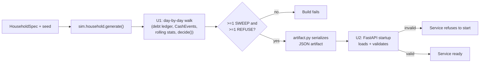

# Decision Engine Frontend MVP

## Summary

Build a day-by-day decision-history generator on top of the existing `engine/` + `sim/`
Python modules (genuinely new code — the repo has no "replay driver" today), serve it from
a small FastAPI service on Cloud Run backed by a single generated JSON artifact (no
database), and add a React Native (Expo, TypeScript) client with a dashboard and an
"explain this decision" assistant. Base narration always calls the existing
`engine/explain.py` directly with zero LLM involvement; an Anthropic Claude tool-use layer
handles only follow-up conversation, retrieving from the artifact via two structured tools
— no embeddings, no vector store.

---

## Problem Frame

The origin requirements doc (linked below) establishes the product shape: a single
pre-authenticated demo household, a shadow-mode decision feed, and a bounded LLM assistant
that narrates but never decides. This plan resolves how to build that on a repo that today
is pure Python with no web framework, no JS/TS tooling, and no deployment config of any
kind — every layer above `engine/`/`sim/` is new.

---

## Requirements

**Dashboard**
- R1. Pre-authenticated dashboard on launch, no onboarding.
- R2. Decision feed, reverse chronological, plain-language reasons.
- R3. Summary stats (interest avoided, buffer, targeted debt).
- R13. Loading/timeout/fallback state on dashboard load.

**Decision data**
- R7. Decisions generated by running `sim/` + `engine/decide.py`, not hand-authored.
- R9. Shadow-mode only — no Plaid, no real money movement.

**Explain assistant**
- R4. Tap-to-explain narration.
- R5. Follow-up conversation retrieving from the household's own history.
- R6. Assistant never states a financial claim it can't trace to a `Decision`.
- R8. "No record" rather than a fabricated answer.

**Platform and deployment**
- R10. React Native (TypeScript) client.
- R11. FastAPI backend.
- R12. GCP Cloud Run deployment.
- R14. Lightweight backend access control.

**Origin actors:** A1 (demo customer/Resfi persona), A2 (interviewer/reviewer), A3 (explain assistant/LLM), A4 (decision engine service/FastAPI)
**Origin flows:** F1 (open dashboard), F2 (ask "why" about a decision)
**Origin acceptance examples:** AE1 (covers R1), AE2 (covers R2, R7), AE3 (covers R5, R8), AE4 (covers R6), AE5 (covers R13, added during doc review)

---

## Scope Boundaries

- Real Plaid account linking or any real bank connection.
- Real ACH transfers or any real money movement.
- The overdraft-reimbursement guarantee (`prd.md` §2.3).
- Onboarding, sign-up, login, or multi-user accounts.
- A live "run today's decision" action or real daily scheduler — decisions are precomputed
  at build time.
- Support for multiple households or user-editable policies.
- Recurring-event detection as a general subsystem (`architecture.md` §3.2) — this plan
  derives `CashEvent`s directly from the known household spec instead (see Key Technical
  Decisions).
- Multi-debt ranking UI — `sim/household.py`'s `HouseholdSpec` only generates one card, so
  `_select_target`'s APR-ranking logic is present in the engine but not exercised by this
  demo's data.

### Deferred to Follow-Up Work

- CI coverage for the `mobile/` TypeScript app beyond a basic typecheck job (e.g. full
  component test suite in CI, device-farm smoke tests): a lightweight `tsc --noEmit` job
  is in scope (U8); anything heavier is a follow-up.
- ADRs for the persistence-artifact and structured-retrieval decisions (`docs/decisions/`):
  short ADRs are created as part of U1 and U4 respectively, but a fuller retrospective ADR
  reviewing both after the demo is used in anger is follow-up work, not blocking.

---

## Context & Research

### Relevant Code and Patterns

- `sim/household.py`'s `History.as_of(day)` (line 186), `History.balance_on(day)` (line
  212), and `History.daily_balances()` (line 216) are the sanctioned primitives for
  building one day's inputs without lookahead.
- `tests/test_outcome.py`'s `household()` helper (lines 342-372) and `snapshot_on()`
  (lines 384-393) show the existing pattern for constructing a `Snapshot` from a `History`
  for one day — the closest existing precedent for U1's precompute loop, though it has
  never been run as a day-by-day walk across a window before.
- `engine/decide.py:45` (`MIN_HISTORY_DAYS = 60`) is the cold-start gate the warm-up
  runway (Key Technical Decisions) exists to satisfy before the served window opens.
- `engine/explain.py:36` (`render(reason)`) and `engine/explain.py:138-139`
  (`explain(decision)`) are the tested, deterministic renderers U3's base-narration
  endpoint calls directly.
- `engine/models.py:20-33` (`money()`) is the only sanctioned way to construct a `Decimal`
  dollar amount; the JSON artifact's (de)serialization boundary (U1/U2) must convert
  through it deliberately, never through a bare float.
- `pyproject.toml` (`packages = ["engine", "sim"]`, `requires-python = ">=3.10"`) and
  `.github/workflows/ci.yml` (lints/tests `engine` and `tests` only, Python 3.12) are the
  conventions U1-U4 and U8 extend.

### Institutional Learnings

- `docs/architecture.md` §3.5 and `docs/decision-engine.md` §1.1: "the LLM narrates the
  decision's reasons; it never produces them" and reasons are codes, not prose, in exactly
  one file. This is the load-bearing constraint behind U3/U4's LLM boundary and R6's
  response-verification guard.
- `docs/learnings/2026-07-13-the-spend-model-over-reserves.md`: `engine/forecast.py`'s
  p90-per-day compounding over-reserves against a household's real spending tail, and is
  **deliberately not fixed** pending a grader. This plan does not touch `forecast.py`'s
  behavior; if the assistant is asked why a sweep was smaller/absent than expected, the
  honest answer may trace to this known, documented over-reservation — the assistant
  should be able to surface the real reason code rather than paper over it (no special
  handling needed beyond not fabricating a different explanation).

### External References

- Cloud Run FastAPI deployment: `gcloud run deploy --source .` (buildpacks), container
  must bind `0.0.0.0:$PORT`, single Uvicorn worker, `PYTHONUNBUFFERED=1`.
- FastAPI `APIKeyHeader` (`fastapi.security.APIKeyHeader`) — standard lightweight
  API-key gating pattern for R14.
- Expo SDK 57 / React Native 0.86, `npx create-expo-app@latest --template blank-typescript`,
  `expo start --web` (Metro + `react-native-web`, production-grade since SDK 50 — not
  deprecated).
- Anthropic Claude Messages API tool-use (`input_schema`, `tool_use`/`tool_result` content
  blocks) — current, non-streaming is sufficient at this scale; rate limits and prompt
  caching are non-issues for a single-tenant demo.

---

## Key Technical Decisions

**Decision-history generation**
- Build the day-by-day precompute as new, independently-tested code (U1) — nothing in
  `engine/`/`sim/` today composes a `HouseholdSpec` + `History` into a sequence of
  `Snapshot`s through `decide()`. This is a narrower, single-policy variant of the
  "replay driver" the repo's own docs call unbuilt (`docs/decision-engine.md` §8.3's
  replay driver sweeps a *range* of caps to find the spend-model bug; this plan's
  precompute walks one fixed policy once) — stated explicitly so an implementer doesn't
  conflate the two.
- Track debt balance as a running ledger during the walk: each day, accrue interest on
  the outstanding balance (`apr / 365`, no intra-cycle compounding — matching
  `engine/interest.py`'s own model) before applying that day's cumulative `CARD_PAYMENT`
  outflows and any sweep from the prior day's decision. Nothing in `sim/`/`engine/`
  maintains this state today; omitting accrual would understate the balance across the
  window and distort the interest-avoided stat (R3) the demo is graded on.
- Track a rolling `swept_this_week` total (trailing 7 days) alongside the debt ledger and
  feed it into each day's `Snapshot` — `Snapshot.swept_this_week` defaults to zero
  (`engine/models.py:229`) if left unset, which would silently prevent `WEEKLY_CAP`
  (`engine/decide.py:192-204`) from ever binding across the whole precomputed window.
- Derive `CashEvent`s directly from the known `HouseholdSpec` at full confidence
  (`income_confidence=1.0`) rather than waiting on the not-yet-built recurring-event
  detector — an explicit, documented demo shortcut, not an oversight. Give each derived
  event a small synthetic `amount_low`/`amount_high` spread (not a degenerate
  `amount_low == amount_high` point estimate) and a small `date_jitter_days`, so
  `forecast.py`'s conservative late/small-inflow, early/large-outflow asymmetry is still
  exercised rather than collapsed by an artificially certain cash-flow model.
- Reuse `sim/household.py`'s payday/bill cadence helpers (`_paydays`, `_semimonthly`,
  `_monthly`) to place derived `CashEvent`s on the same schedule `generate()` itself
  uses, rather than reimplementing equivalent cadence math with its own drift risk —
  accepting the coupling to currently-private helpers (promote them to a small public
  wrapper if needed) in exchange for guaranteed consistency with the realized `History`.
- Compute `income_variation`/`daily_discretionary_high` from a trailing 90-day (or
  shorter, floored at available history) window via `History.as_of(day)` — never
  full-history lookahead.
- Run a 60-day warm-up runway before the served window starts, so the visible feed never
  opens on a wall of `INSUFFICIENT_HISTORY` refusals.
- Assert at build time that the served window contains at least one `SWEEP` and at least
  one `REFUSE`; fail the build rather than ship a demo that's all-one or all-the-other.
- Pin the window to fixed calendar dates (not relative to deploy/build time) so repeated
  deploys show identical content.

**Backend & LLM boundary**
- Persistence is a single generated JSON artifact loaded into memory at FastAPI startup;
  the service validates the artifact and refuses to start on malformed/missing data
  (fail fast at startup, never 500-per-request on bad data).
- R14's access control is a `fastapi.security.APIKeyHeader` dependency checked against a
  Secret Manager-backed secret (`gcloud run deploy --set-secrets`, not a plain env var) —
  not a login system. Because the same key is embedded in the mobile/web client bundle
  (`mobile/src/api/client.ts`), it is trivially recoverable by anyone inspecting the app —
  this is the accepted tradeoff, not an oversight: the key's job is deterring opportunistic
  traffic (crawlers, scanners, accidental discovery of the bare Cloud Run URL), not
  resisting a determined client-side extraction. Acceptable because this is a single demo
  household with synthetic data and no real money movement.
- Base narration (R4/U3) calls `engine.explain.explain()`/`render()` directly — zero
  network or LLM call for simply viewing a decision's reason.
- The LLM is invoked only when the user sends a follow-up message (U4); conversation
  history is held client-side and resent each turn — no server-side session store, so
  the "no persistence beyond the JSON artifact" decision holds.
- Retrieval is two structured tools over the in-memory artifact — `get_decision(date)`
  and `list_decisions(start, end, reason_code=None)` — not embeddings or a vector store;
  a date outside the window (before start, after end, or excluded as a warm-up day) is a
  single uniform "no record" response from the tool, satisfying R8/AE3 without
  distinguishing the three cases in user-facing behavior.
- R6/AE4 is enforced by a response-verification guard with three checked surfaces per
  cited decision, not a presence-only scan: (1) dollar amounts, exact-matched against
  that decision's tool-result `Decimal` fields (`amount`, `low`, `buffer`, `reserved`,
  `interest_avoided`, `idle_cash_elsewhere`) — exact, not fuzzy/tolerance-matched, since
  the source values are already precise `Decimal`s from `engine/models.py`'s `money()`
  and a loose tolerance would let a near-miss hallucinated figure pass; (2) the
  decision's `Action` (`SWEEP`/`REFUSE` — `engine/models.py:232-234` has only these two
  values; a debt-free household's `REFUSE` carries a `ReasonCode.NO_DEBT` reason, it is
  not a third `Action`, and the guard/UI must derive "paid off" as
  `action == REFUSE and NO_DEBT in decision.codes`, never as a flat third enum value);
  and (3) the reason code/label. Extraction is regex/number-parsing over the assistant's
  final text (not free-form NLP interpretation): for each dollar figure or reason-code
  phrase the guard extracts, it checks membership against the flat set of
  `(date, field, value)` triples the backend itself recorded from this turn's actual
  `tool_use`/`tool_result` exchanges — the guard already knows which decision's data was
  fetched (from the tool call's own `date` argument), so it is matching structured
  call/result pairs, not inferring attribution from prose. Each claimed value is bound to
  the specific `(date, field)` it's attributed to — not treated as an unordered pool
  across the turn's tool results — so a response can't recombine two real values from
  different decisions into a false claim (e.g., citing decision A's amount against
  decision B's date). Every turn where the assistant states a decision-outcome fact must
  include a fresh tool call that turn, even to restate something established earlier in
  the conversation — this closes an ambiguity around resent client-side history that
  would otherwise either bypass the guard or produce false-negative fallbacks. Any claim
  that doesn't verify replaces the whole response with a "no record" fallback — this is
  the actual test surface for AE4, not a system-prompt instruction alone. Refinements
  (e.g., currency-formatting variants) are specified in the ADR
  (`docs/decisions/0003-structured-tool-calling-over-embeddings.md`); the exact-match
  default and the extraction mechanism above are decided here, not left to
  implementation-time interpretation.
- The backend passes the window's last served day as an explicit "today" anchor in every
  turn's context, so relative-date phrases ("last Tuesday") resolve against the demo's
  fixed window rather than wall-clock time.
- Tool-call loop is bounded (cap at 5 round-trips per user turn) with an explicit
  wall-clock timeout on each Anthropic API call (same rigor as R13's dashboard timeout,
  just on the backend side instead of the client); a malformed tool call gets one retry
  prompt to the model, then the turn fails closed to a per-turn "assistant unavailable,
  try again" message — this never fabricates an explanation as a fallback. Three
  conceptually distinct outcomes share the assistant's response surface but are not the
  same event: a tool's uniform "no record" reply (an honest epistemic answer, not a
  failure), a verification-guard rejection (a caught-hallucination event), and a
  transport/availability failure (Anthropic error, timeout, or loop-cap exceeded) — kept
  distinct in the ADR so a future logging pass doesn't conflate "the model tried to
  fabricate something" with "there was nothing to answer."
- `POST /assistant/message` carries an in-process rate cap (a fixed per-minute/per-day
  request ceiling, in-memory counter — safe given the single-Uvicorn-worker,
  `--min-instances=1` deployment has no distributed-state problem to solve). Because the
  API key is recoverable from the client bundle (see the access-control decision above),
  key leakage is the expected steady state rather than an edge case, and this cap is what
  actually bounds the resulting Anthropic spend exposure — distinct from the existing
  outage/timeout risk, which only covers *unavailability*, not *abuse*.

**Frontend**
- Expo TypeScript `blank-typescript` template (not the default Router+tabs scaffold —
  this MVP's flat dashboard-plus-modal shape doesn't need file-based routing).
- Single fixed-width layout (e.g. max-width ~480px, centered) reused as-is across
  simulator, device, and Expo web — no responsive breakpoints. A minimal accessibility
  floor applies to that same single layout: the modal and its free-text input are
  keyboard-operable (no mouse/touch-only interaction) for the Expo-web path, and feed
  cards/buttons meet standard minimum touch-target sizing — scoped to what's feasible for
  an MVP demo, not a full audit.
- The explain assistant (`ExplainModal`) is a full-screen RN modal, not a partial
  overlay — this resolves a real contradiction an earlier draft had: a full-screen modal
  blocks the dashboard underneath, so "switch to a different decision while the modal is
  open" is not a reachable interaction and is not built. Instead, the modal has an
  explicit close (X) control in its header plus Android hardware-back handling, both of
  which dismiss back to the dashboard; every modal open is a fresh mount against the
  tapped decision, so a "reset the conversation" step isn't needed — there is no
  conversation to carry over. Input is free-text (not canned prompts).
- A `REFUSE` decision whose reason is `NO_DEBT` (debt paid off mid-window — see the
  Backend & LLM boundary note on `Action` vs. reason code) renders a "paid off" state in
  the feed instead of a `$0`/`0% APR` targeted-debt stat — built defensively, though U1's
  chosen spec/seed is tuned so this isn't actually triggered inside the served window.
- The dashboard's empty-state (an empty served window, distinct from the R13
  unreachable-backend fallback and the `NO_DEBT` "paid off" state) shows a short static
  message — e.g. "No decisions in this window yet" — rather than a blank screen.
- Demonstrating this MVP's stated "Agentic AI Systems" job-req coverage honestly: the
  explain assistant is narration + structured tool-calling, never an autonomous
  decision-maker (see Backend & LLM boundary) — this plan does not claim to build
  autonomous agentic behavior, and doesn't need to; the assistant's retrieval loop is the
  demonstrable piece.

**Deployment**
- `gcloud run deploy --source .` (buildpacks, no hand-written Dockerfile unless a
  dependency needs it), single Uvicorn worker, `--min-instances=1` to avoid a visible
  cold start during a live interview demo (cost is trivial at this scale), **and
  `--max-instances=1`** — `--min-instances` only sets a floor against cold starts, it
  does not cap scale-out, and the in-process rate cap (below) is only a real bound on
  Anthropic spend exposure if exactly one instance ever runs; without `--max-instances=1`
  pinned too, a burst of traffic against a leaked API key would scale to multiple
  instances, each holding its own independent counter, silently multiplying the ceiling
  the cap is meant to enforce.
- The precompute-generated JSON artifact is committed to the repo (e.g.
  `backend/data/decisions.json`), regenerated locally/in CI when the demo spec/seed
  changes, rather than produced by a build step invoked during deploy — `gcloud run
  deploy --source .`'s buildpacks package whatever's present in the source directory, so
  a committed file needs no extra build wiring, and U2's startup validation still fails
  fast if it's ever missing or stale.
- CI (`ci.yml`) is extended to lint/test the new `backend/` package alongside `engine`;
  a lightweight `tsc --noEmit` job is added for `mobile/` (no JS/TS CI exists today).
- The backend enables `CORSMiddleware` with an explicit allowed-origins list, since the
  `expo start --web` verification path (U5/U6) runs the client in a browser — a different
  origin from the Cloud Run URL/`localhost` dev backend. Native (simulator/device) targets
  aren't affected, so this is easy to miss if only the RN-native path is considered.

---

## Open Questions

### Resolved During Planning

- Persistence layer (origin's Outstanding Questions): a generated JSON artifact, not
  Postgres/Cloud SQL — the data is a few hundred records for one household, read-only,
  and doesn't need a database.
- RAG retrieval mechanism (origin's Outstanding Questions): structured tool-calling over
  the artifact, not embeddings — confirmed against current best-practice guidance for
  small structured datasets.
- LLM provider (origin's Outstanding Questions): Anthropic Claude (Sonnet-class) via the
  Messages API's tool-use mechanism.
- The six items deferred in the origin doc's doc-review pass (Agentic AI wording,
  transaction-history vs. decision-history scope, assistant input mechanism, exit path,
  layout strategy, `explain.py` reuse) are each resolved above in Key Technical Decisions
  (Agentic AI and exit path resolved in the Frontend cluster; the rest in Backend & LLM
  boundary and Frontend).
- `NO_DEBT` is a `ReasonCode` on a `REFUSE` `Action`, not a third `Action` value
  (`engine/models.py:232-234` has only `SWEEP`/`REFUSE`) — this plan's guard, UI, and
  precompute description all derive "paid off" the same way:
  `action == REFUSE and NO_DEBT in decision.codes`.
- `Snapshot.swept_this_week` and interest accrual on the debt ledger, both silently
  absent from an earlier draft, are now explicit steps in U1's day-by-day walk (see
  Key Technical Decisions).
- Debt-paid-off mid-window (flagged FYI in doc review): defensive UI state added (U6),
  and the demo's own spec/seed avoids actually triggering it.

### Deferred to Implementation

- Exact `HouseholdSpec` parameters and seed for the demo persona (starting balances, APR,
  income cadence) — tune during U1's implementation against the build-time
  sweep/refuse assertion, starting from `tests/test_outcome.py`'s `household()` helper
  (lines 342-372) as a base since it already matches `USERS.md`'s persona closely.
- Exact served-window length (how many days beyond the 60-day warm-up) — pick during U1
  based on how many days it takes to naturally surface both a sweep and a refusal with
  the chosen spec.

---

## High-Level Technical Design

> *This illustrates the intended approach and is directional guidance for review, not
> implementation specification. The implementing agent should treat it as context, not
> code to reproduce.*

**Build-time: precompute is a one-time, offline step — not part of any request path.**



**Runtime: F1 (dashboard) never touches the LLM; F2 splits into a no-LLM base-narration
lane and an LLM follow-up loop with three distinct outcomes.**

```mermaid
sequenceDiagram
    participant C as RN Client
    participant B as FastAPI Backend
    participant A as Anthropic Claude

    Note over C,B: F1 — dashboard open (U6)
    C->>B: GET /decisions (API key)
    B-->>C: served window (or timeout -> fallback message, R13/AE5)

    Note over C,B: F2 part 1 — tap to explain (U3, U7) — no LLM call
    C->>B: GET /decisions/{date}/explain (API key)
    B-->>C: engine.explain.explain() rendering

    Note over C,B,A: F2 part 2 — follow-up conversation (U4, U7)
    C->>B: POST /assistant/message (history + new message + "today" anchor)
    loop up to 5 rounds
        B->>A: message + tool defs
        A-->>B: tool_use (get_decision / list_decisions)
        B->>B: execute against in-memory artifact
        B->>A: tool_result
    end
    A-->>B: final text
    B->>B: verification guard (per-decision (date, field) binding)
    alt guard passes
        B-->>C: narrated response
    else guard rejects (caught hallucination)
        B-->>C: "no record" fallback
    else transport failure (timeout / loop cap / malformed args after retry)
        B-->>C: "assistant unavailable, try again"
    end
```

The three F2-follow-up outcomes are conceptually distinct even though two of them render
similar "no record"-shaped text to the user: a tool's own "no record" reply is an honest
epistemic answer (R8), a guard rejection is a caught-hallucination event, and a transport
failure is an availability problem — kept distinct here so a future logging/monitoring
pass doesn't conflate "the model tried to fabricate something" with "there was nothing to
answer."

---

## Implementation Units

### U1. Household decision-history precompute

**Goal:** Generate the demo household's full decision history — debt ledger, derived
`CashEvent`s, rolling stats, day-by-day `Snapshot`/`Decision` pairs across a warm-up +
served window — and serialize it to the JSON artifact U2 loads.

**Requirements:** R7, R9

**Dependencies:** None

**Files:**
- Create: `backend/precompute.py`
- Create: `backend/artifact.py` (JSON schema + (de)serialization for `Decision`/`Snapshot`
  fields, including `Decimal`/`date`/`Enum` encoding)
- Create: `docs/decisions/0002-generated-json-artifact-over-database.md`
- Test: `tests/test_precompute.py`

**Approach:**
- Pick (or extend) a `HouseholdSpec` matching `USERS.md`'s persona, adapting
  `tests/test_outcome.py`'s `household()` helper.
- Walk `[start, start + warmup_days + served_days)` day by day: derive `CashEvent`s from
  the spec at full confidence with a small synthetic `amount_low`/`amount_high` spread
  and `date_jitter_days` (reusing `sim/household.py`'s `_paydays`/`_semimonthly`/
  `_monthly` cadence helpers for scheduling), accrue interest on the debt ledger
  (`apr / 365`, matching `engine/interest.py`) then apply that day's `CARD_PAYMENT`
  outflows and any sweep from the prior day, roll a trailing-7-day `swept_this_week`
  total, compute rolling `income_variation`/`daily_discretionary_high` from
  `History.as_of(day)`, build a `Snapshot` for the day (constant "healthy" placeholders
  only for `balance_age_days`/`connection`/`sweeps_in_flight` — this demo has no live
  Plaid connection to report on), call `decide()`, and apply any resulting sweep to the
  ledger before the next day.
- Only persist days from `start + warmup_days` onward as the served window.
- Assert the served window contains ≥1 day with `Action.SWEEP` and ≥1 day with
  `Action.REFUSE`; raise (failing the build) otherwise.
- Serialize the served window's `Decision`s (plus the minimal `Snapshot` display fields
  R3 needs) to a single JSON file via `artifact.py`, committed to the repo (see Key
  Technical Decisions — Deployment) rather than generated at deploy time.

**Execution note:** Implement the debt-ledger (interest accrual + payments/sweeps +
`swept_this_week`) and rolling-stats logic test-first — both are new stateful
derivations with no existing precedent to copy from.

**Technical design:**

> *Directional only — not implementation specification.*

```
for day in window:
    events = derive_cash_events(spec, day)          # full confidence + small range/jitter, from spec directly
    debt_balance = accrue_interest(debt_balance, apr)  # apr/365, before payments/sweeps
    debt_balance -= sum(card_payments_on(day)) 
    if prior_decision and prior_decision.action == SWEEP: debt_balance -= prior_decision.amount
    swept_this_week = rolling_7day_sweep_total(day)
    stats = rolling_stats(history.as_of(day))       # trailing 90d, floored at available history
    snapshot = build_snapshot(day, history, debt_balance, events, stats, swept_this_week)
    decision = decide(snapshot)
    prior_decision = decision
    if day >= start + warmup_days: served.append((day, snapshot, decision))
assert any(d.action == Action.SWEEP for _, _, d in served)
assert any(d.action == Action.REFUSE for _, _, d in served)
```

**Patterns to follow:**
- `tests/test_outcome.py`'s `snapshot_on()`/`household()` (lines 342-393)
- `sim/household.py`'s `History.as_of()`/`balance_on()` for no-lookahead access, and its
  `_paydays`/`_semimonthly`/`_monthly` cadence helpers for scheduling derived events
- `engine/interest.py`'s daily-accrual model (`apr / 365`, no intra-cycle compounding)

**Test scenarios:**
- Happy path: given a fixed `(spec, seed)`, the generator produces a byte-identical
  artifact across two runs.
- Happy path: the served window contains at least one `SWEEP` and at least one `REFUSE`.
- Edge case: a day where a sweep occurs correctly reduces the debt ledger for all
  subsequent days.
- Edge case: rolling stats on a day with less than the full lookback window use only the
  available history, not a shorter/longer window silently.
- Edge case: if the debt ledger reaches zero inside the window, subsequent days decide
  `REFUSE` with reason `NO_DEBT` and are still included in the served output (not
  dropped).
- Edge case: the ledger accrues interest on the outstanding balance before applying
  payments/sweeps each day — a day with no payment or sweep still grows the balance.
- Edge case: two sweeps within the same trailing 7-day window correctly bind
  `WEEKLY_CAP`, producing a reduced or refused sweep on the second one.
- Error path: if the chosen `(spec, seed, window)` never produces both a `SWEEP` day and
  a `REFUSE` day, the build raises rather than emitting an incomplete artifact.
- Integration: the full precompute-to-artifact path round-trips through
  `artifact.py`'s (de)serialization without precision loss on `Decimal` fields.

**Verification:** Running the precompute script against the committed demo spec/seed
produces a valid artifact containing ≥1 sweep and ≥1 refuse, and `tests/test_precompute.py`
passes.

---

### U2. FastAPI service scaffold

**Goal:** Stand up the backend service: load and validate the artifact at startup, expose
a decision-history endpoint, and gate the service behind an API key.

**Requirements:** R11, R14

**Dependencies:** U1

**Files:**
- Create: `backend/main.py`
- Create: `backend/auth.py` (`APIKeyHeader` dependency)
- Create: `backend/requirements.txt` (or extend `pyproject.toml`'s optional deps)
- Modify: `pyproject.toml` (add `backend` to `packages`)
- Test: `tests/test_backend_api.py`

**Approach:**
- On startup, load and validate the artifact (schema check via `artifact.py`); raise
  and refuse to start on malformed/missing data rather than serving 500s per request.
- `GET /decisions` returns the served window's decisions (for U6's feed/stats).
- All routes depend on the `APIKeyHeader` check except a `/healthz` route (no key
  required, so Cloud Run's own health probing isn't blocked).
- Enable `CORSMiddleware` with an explicit allowed-origins list so the Expo-web target
  (a browser origin) can call the API — without it, U5/U6's web verification path fails
  even though native targets work fine.

**Patterns to follow:**
- `fastapi.security.APIKeyHeader` standard dependency-injection pattern.

**Test scenarios:**
- Happy path: `GET /decisions` with a valid API key returns the artifact's served window.
- Error path: `GET /decisions` with a missing/invalid API key returns 401/403.
- Error path: starting the service against a malformed artifact fails startup rather than
  starting and erroring per-request.
- Happy path: `GET /healthz` succeeds without an API key.

**Verification:** Service starts against the real artifact, `/healthz` and `/decisions`
respond as expected, and `tests/test_backend_api.py` passes.

---

### U3. Base narration endpoint

**Goal:** Serve R3's summary stats and R4's plain-language decision narration without any
LLM/network dependency.

**Requirements:** R3, R4

**Dependencies:** U1, U2

**Files:**
- Modify: `backend/main.py`
- Test: `tests/test_backend_api.py`

**Approach:**
- `GET /decisions/{date}/explain` calls `engine.explain.explain()`/`render()` on the
  stored `Decision` for that date and returns the rendered sentences directly — no LLM
  call in this path at all.
- Summary stats (cumulative interest avoided, current buffer, targeted debt) are computed
  once from the served window and exposed alongside `/decisions`.

**Test scenarios:**
- Happy path: `/decisions/{date}/explain` for a known refusal date returns
  human-readable text (not a raw `ReasonCode`).
- Edge case: a `REFUSE`/`NO_DEBT` decision's explain response reads as the engine's own
  "congratulations" copy, not an error.
- Error path: `/decisions/{date}/explain` for a date not in the served window returns a
  clear "no record" response (same posture as U4's uniform tool response), not a 500.
- Covers AE2: a refusal appears with a human-readable reason.

**Verification:** Every date in the served window resolves to non-empty, tone-correct
narration with zero outbound network calls.

---

### U4. Explain-assistant LLM endpoint

**Goal:** Handle R5's follow-up conversation via Claude tool-use over the artifact, with
R6/R8's no-fabrication guarantee enforced in code.

**Requirements:** R5, R6, R8

**Dependencies:** U1, U2

**Files:**
- Create: `backend/assistant.py` (tool definitions, Claude call, response-verification
  guard)
- Create: `docs/decisions/0003-structured-tool-calling-over-embeddings.md`
- Test: `tests/test_assistant.py`

**Approach:**
- `POST /assistant/message` accepts the current decision's context, the client-held
  conversation history, and the new user message.
- Tools: `get_decision(date)`, `list_decisions(start, end, reason_code=None)`, both
  reading the in-memory artifact.
- Context passed every turn includes the window's last served day as "today," so relative
  dates resolve against the demo's fixed window.
- Bound the tool-call loop (cap 5 round-trips/turn) with an explicit per-call timeout on
  the Anthropic API call; on a malformed tool call, retry once, then fail the turn closed
  to an "assistant unavailable" response.
- Apply the in-process rate cap on this endpoint (see Key Technical Decisions).
- Before returning, the response-verification guard checks the model's final text against
  each cited decision's tool-result fields — dollar amounts (exact-matched), `Action`,
  and reason code — bound to that decision's `(date, field)`, not an unordered pool
  across the turn's results; on failure, replace the response with a "I don't have that
  on record" message. See the guard's full contract (including the extraction mechanism)
  in Key Technical Decisions and
  `docs/decisions/0003-structured-tool-calling-over-embeddings.md`.

**Execution note:** Implement the response-verification guard test-first — it's the
actual enforcement mechanism behind R6/AE4, not the LLM's own restraint. Given it's the
plan's most novel piece with no existing precedent to adapt from, consider a small
throwaway spike against synthetic tool-result data early in Phase A (before U1's full
precompute is built) to surface extraction-format problems while still cheap to change.

**Patterns to follow:**
- `engine/explain.py`'s reason-code discipline (retrieve/verify against structured data,
  never trust free-form text as a financial claim).

**Test scenarios:**
- Happy path: a follow-up like "why not last Tuesday?" resolves to a tool call and a
  narrated answer.
- Edge case: a date before the window start, after the window end, or on a warm-up day
  (excluded from the served window) all resolve to a uniform "no record" response.
- Covers AE3: a question about a date with no decision returns "no record," not a
  fabricated one.
- Covers AE4: any assistant response containing a dollar amount/claim traces to a tool
  result from that turn; a synthetic test forcing the model to assert an untraceable
  claim is caught and replaced by the guard.
- Covers AE4 (adversarial): given tool results for two different decisions in the same
  turn (e.g., a $50 sweep on one date and a $750 buffer mentioned in a refusal's reason
  on another), a response that recombines them into a false claim (e.g., "$50 swept on"
  the other decision's date) is caught by the guard's per-`(date, field)` binding — a
  presence-only check would have let this through.
- Covers AE4 (adversarial): a response stating the correct dollar amount and outcome
  type but a fabricated/wrong reason code is caught by the guard the same as a wrong
  dollar amount.
- Error path: a simulated Anthropic API failure/timeout mid-conversation returns the
  per-turn "assistant unavailable" message, not a fabricated explanation and not a crash.
- Error path: a malformed tool-call argument (e.g. invalid date string) is retried once,
  then fails closed.

**Verification:** `tests/test_assistant.py` passes, including the adversarial
prompt-injection-style case where the model is pushed to assert an unverifiable claim.

---

### U5. Expo app scaffold

**Goal:** Stand up the RN/TypeScript client and wire it to the backend.

**Requirements:** R10

**Dependencies:** U2

**Files:**
- Create: `mobile/` (Expo `blank-typescript` scaffold)
- Create: `mobile/src/api/client.ts` (API-key-authenticated fetch wrapper)
- Test: `mobile/src/api/client.test.ts`

**Approach:**
- `npx create-expo-app@latest mobile --template blank-typescript`.
- `client.ts` centralizes the base URL and API key header so no other file constructs
  requests directly.

**Test scenarios:**
- Happy path: `client.ts` attaches the API key header to every request.
- Test expectation: none beyond the client wrapper — the scaffold itself has no
  behavior to test.

**Verification:** `npx expo start --web` runs the scaffold against the deployed (or
locally-run) backend and successfully fetches `/decisions`.

---

### U6. Dashboard screen

**Goal:** Render R2/R3's feed and stats with the loading/error/empty states R13 and the
flow analysis require.

**Requirements:** R1, R2, R3, R13

**Dependencies:** U3, U5

**Files:**
- Create: `mobile/src/screens/Dashboard.tsx`
- Create: `mobile/src/components/DecisionFeedItem.tsx`
- Test: `mobile/src/screens/Dashboard.test.tsx`

**Approach:**
- On mount, fetch `/decisions`; render summary stats above the fold, feed below, per the
  doc-reviewed content hierarchy.
- Loading state shows a spinner with a bounded timeout, then a fallback message on
  failure (R13/AE5) — visually distinct from the "paid off" state (a `REFUSE`/`NO_DEBT`
  decision), from the empty-state (a served window with zero decisions — see Key
  Technical Decisions for its copy), and from a legitimately zero-stat first day.
- A `REFUSE` decision whose reason is `NO_DEBT` renders the "paid off" banner in place of
  the targeted-debt stat.

**Patterns to follow:**
- `docs/design/look-and-feel.md`'s card style (white rounded card, one outcome per card,
  restrained color roles for sweep vs. refusal).

**Test scenarios:**
- Happy path: given a successful fetch, stats render above the feed, feed renders
  reverse-chronological.
- Covers AE1: no login/signup/account-linking screen appears before the dashboard.
- Covers AE2: a refusal in the feed shows human-readable text.
- Covers AE5: an unreachable backend shows the loading state, then the fallback message
  after the bounded timeout.
- Edge case: a `REFUSE`/`NO_DEBT` decision renders the "paid off" state, not a `$0` stat.
- Edge case: an empty decision array renders the defined empty-state copy (see Key
  Technical Decisions), not a blank screen.

**Verification:** Dashboard renders correctly against the real backend and against a
mocked failing backend (for the R13/AE5 path).

---

### U7. Explain assistant modal

**Goal:** Implement F2's tap-to-explain and follow-up conversation UI.

**Requirements:** R4, R5, R6, R8

**Dependencies:** U3, U4, U6

**Files:**
- Create: `mobile/src/screens/ExplainModal.tsx`
- Test: `mobile/src/screens/ExplainModal.test.tsx`

**Approach:**
- Tapping a decision opens `ExplainModal` full-screen (see Key Technical Decisions —
  Frontend) and fetches U3's base narration; a loading spinner covers the fetch, with the
  same bounded-timeout-then-fallback pattern as R13/AE5 if it's slow or fails — no
  network call to the LLM endpoint at this point.
- An explicit close (X) control in the modal header, plus Android hardware-back, both
  dismiss back to the dashboard. Because the modal is full-screen and always freshly
  mounted per decision, there is no "switch decisions while open" case to handle and no
  explicit conversation-reset logic — closing and reopening on a different decision is
  the only path, and each open starts clean by construction.
- A free-text input at the bottom of the modal sends follow-ups to U4's endpoint;
  conversation history is held in the modal's local state and resent each call. While a
  turn is in flight (the backend's tool-call loop plus Anthropic latency can take several
  real seconds), the input is disabled and a "thinking" indicator shows, so the user
  isn't tempted to resend or assumes the app is frozen.
- A per-turn failure (LLM/backend error) renders an inline "assistant unavailable, try
  again" bubble without closing the modal or fabricating a reply; the input re-enables
  after the failure.

**Test scenarios:**
- Happy path: opening the modal shows base narration with zero LLM calls made.
- Happy path: sending a follow-up calls the assistant endpoint and renders the reply.
- Edge case: the base-narration fetch on open is slow/fails and shows the same
  loading-then-fallback pattern as the dashboard (R13/AE5).
- Edge case: the input is disabled and a thinking indicator shows for the duration of an
  in-flight follow-up turn, then both clear when the response (or error) arrives.
- Edge case: the close control and Android back both return to the dashboard.
- Error path: a failing assistant call renders the per-turn error bubble, not a crash or
  fabricated reply, and re-enables the input afterward.
- Covers AE3, AE4: see U4 — this unit renders whatever U4 returns; the guarantees
  themselves are U4's test surface.

**Verification:** Manual walkthrough of tap → base narration → follow-up (with visible
thinking state) → response → close, confirming no LLM call before the first follow-up
and no dead-end UI state on failure.

---

### U8. Cloud Run deployment and CI

**Goal:** Ship the backend to Cloud Run and extend CI to cover the new code.

**Requirements:** R12, R14

**Dependencies:** U2, U3, U4, U5

**Files:**
- Modify: `.github/workflows/ci.yml` (lint/test `backend`; add a `mobile` typecheck job)
- Create: `backend/Dockerfile` (only if buildpacks can't infer the build — try
  `gcloud run deploy --source .` first)

**Approach:**
- Deploy via `gcloud run deploy --source .`, `--min-instances=1 --max-instances=1`
  (avoids both a visible cold start mid-demo and the rate cap's single-instance
  assumption silently breaking under autoscale — see Key Technical Decisions), container
  listens on `0.0.0.0:$PORT`, single Uvicorn worker, `PYTHONUNBUFFERED=1`.
- The committed JSON artifact (see Key Technical Decisions) ships as part of the source
  buildpacks package — no separate build step generates it at deploy time.
- API key and the Anthropic API key are set via `gcloud run deploy --set-secrets`
  (Secret Manager-backed), not plain environment variables — a plain env var is visible
  in `gcloud run services describe`/deployment history, a Secret Manager reference isn't.
  Never committed.
- `CORSMiddleware`'s allowed-origins list is configured for the deployed Expo-web origin
  in addition to local dev origins (see U2).
- Extend the existing `quality` CI job (or add a parallel one) to lint/test `backend`
  alongside `engine`; add a lightweight `mobile` job running `tsc --noEmit` (full test
  suite in CI is follow-up work, see Scope Boundaries).

**Test scenarios:**
- Test expectation: none beyond CI configuration — this unit has no new application
  behavior of its own.

**Verification:** A deployed Cloud Run URL responds to `/healthz` and (with the API key)
`/decisions`; CI is green on a PR touching `backend/` and `mobile/`.

---

## System-Wide Impact

- **Interaction graph:** `engine/`/`sim/` gain a new consumer (`backend/precompute.py`)
  but are not modified — the plan is additive only at this layer.
- **Error propagation:** backend failures (bad artifact, LLM outage) fail closed at their
  own layer (startup crash, per-turn error bubble) rather than propagating a fabricated
  or silently-wrong result to the client.
- **State lifecycle risks:** the artifact is regenerated wholesale on each precompute run
  (no partial-write/merge concerns); the assistant's conversation state lives only in the
  client for the session's lifetime and is discarded on modal close or decision switch.
- **API surface parity:** N/A — this is the first API surface in the repo.
- **Integration coverage:** U1→U2 (artifact load/validation), U4's full tool-call loop
  (not unit-testable in isolation from the guard), and U6/U7's fetch-and-render paths all
  need integration-level tests beyond per-function unit tests.
- **Unchanged invariants:** `engine/decide.py`'s gates, buffer/cap logic, and
  `engine/forecast.py`'s (deliberately unfixed) over-reservation behavior are untouched —
  the demo surfaces whatever the engine already decides.

---

## Risks & Dependencies

| Risk | Mitigation |
|------|------------|
| Cloud Run cold start visible during a live interview | `--min-instances=1` keeps an instance warm |
| Anthropic API outage/timeout during the demo | Base narration never depends on the LLM; follow-up failures show a per-turn error bubble (bounded per-call timeout), not a crash |
| Anthropic API cost run-up from key leakage or a runaway loop | In-process rate cap on `POST /assistant/message`, made authoritative by pinning `--max-instances=1` (not just `--min-instances=1`); tool-call loop capped at 5 round-trips/turn |
| Generated demo data is all-sweep or all-refuse | Build-time assertion fails the build before a bad artifact ships |
| Debt payoff mid-window breaks the targeted-debt stat | Defensive "paid off" UI state (U6) plus spec/seed tuning to avoid triggering it (U1) |
| LLM asserts an untraceable or recombined-from-real-values claim (amount, outcome, or reason code) | Response-verification guard in U4 binds every cited value to its source decision's `(date, field)`, fails closed to "no record" |
| API key ships inside the public mobile/web client bundle and is trivially recoverable | Documented as expected, not a gap — the key gates opportunistic traffic only; blast radius is bounded by the rate cap above and by the data being non-sensitive/synthetic |
| New Python package (`backend/`) and new JS/TS toolchain (`mobile/`) ship uncovered by CI | U8 extends `ci.yml` for both |
| Expo-web verification fails against a real backend due to browser CORS | `CORSMiddleware` with an explicit allowed-origins list (U2/U8) |

---

## Alternative Approaches Considered

- **Postgres/Cloud SQL for the decision history** (matches `architecture.md`'s eventual
  intent): rejected for this MVP — a few hundred read-only records for one household
  doesn't need a database, and it adds provisioning/cost/complexity with no benefit at
  this scale. A generated JSON artifact is the smaller, sufficient choice; Postgres
  remains the documented target once the product moves past a single demo household.
- **Embedding/vector-store retrieval for the explain assistant**: rejected — the dataset
  is small and structured (not prose/documents), and current guidance converges on
  structured tool-calling as both simpler and more precise for this shape of data.
- **Including cold-start days honestly in the served window** (vs. a warm-up runway):
  rejected as the default demo experience — it would open the feed on a wall of
  `INSUFFICIENT_HISTORY` refusals, working against the "understand in a minute" success
  criterion. The engine's honest cold-start behavior is preserved (nothing is faked); the
  warm-up runway only changes which days are *shown*, not how the engine decides.

---

## Phased Delivery

### Phase A — Backend & decision data
- U1 (precompute), U2 (service scaffold), U3 (base narration), U4 (assistant endpoint)

### Phase B — Frontend
- U5 (Expo scaffold), U6 (dashboard), U7 (assistant modal)

### Phase C — Deployment
- U8 (Cloud Run + CI)

---

## Documentation / Operational Notes

- Continue appending to `docs/implementation-notes.md` per ticket, per the repo's
  existing convention (two entries already present).
- Two short ADRs are created as part of U1/U4 (persistence artifact, structured
  tool-calling) per the repo's `docs/decisions/` convention.

---

## Sources & References

- **Origin document:** [docs/brainstorms/2026-07-13-decision-engine-frontend-mvp-requirements.md](../brainstorms/2026-07-13-decision-engine-frontend-mvp-requirements.md)
- Related code: `engine/decide.py`, `engine/explain.py`, `engine/models.py`,
  `sim/household.py`, `tests/test_outcome.py`
- Related docs: `docs/architecture.md`, `docs/decision-engine.md`,
  `docs/learnings/2026-07-13-the-spend-model-over-reserves.md`,
  `docs/design/look-and-feel.md`, `USERS.md`
