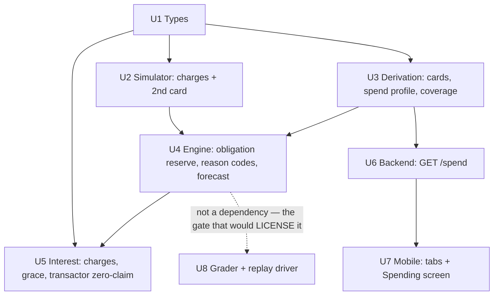

# Card Spend, Portfolio Reserve, and the Spend-Comprehension Surface

## Summary

Make credit-card spend a first-class engine input, and in doing so close a hole in the safety
core. Today every simulated discretionary transaction hits *checking*; `CardSpec.balance` is a
static input and `CardSpec.payment` is a fixed monthly constant. The card is a thing that gets
paid down and never charged. Because of that, the engine has never seen a card used as a payment
instrument — and its reserve, which sums each card's **minimum payment**, silently under-reserves
any household that pays *more* than the minimum.

The fix is one idea: **a card charge is not a checking outflow — it is a checking outflow
scheduled for the due date of the statement it lands on.** Model that, and three things follow:
the reserve can cover what a card will *actually* take; the forecast can finally skip card-payment
events honestly; and the spend dashboard the user asked for turns out to be the same data
structure, rendered a release before it is trusted with a decision.

**This plan tightens. It does not loosen.** The reserve grows (safe, ships now). Swapping the
forecast onto an empirical spend quantile would shrink it (unsafe without measurement, explicitly
deferred — see U8 and Scope Boundaries).

---

## Build Progress

*Last updated 2026-07-14.*

**Every implementation unit in this plan is built and on `main`.** 357 Python tests, 39 mobile
tests, ruff and typecheck clean.

| Unit | Ticket | Status | Landed in |
|------|--------|--------|-----------|
| U1 Types: card, cycle, portfolio, spend profile | `0010` | done | #28 |
| U2 Simulator: card charges, behaviour-driven payment, 2nd card | `0011` | done | #28 |
| U3 Derivation: cards, spend profile, coverage detector | `0012` | done | #28 |
| U4 **Engine: the obligation reserve** | `0013` | done | #28 |
| U5 Interest: charges, grace, transactor zero-claim | `0014` | done | #29 |
| U6 Backend: `GET /spend` | `0015` | done | #29 |
| U7 Mobile: tabs + Spending screen | `0016` | done | #29 — **attestation action not built, see below** |
| U8 Grader + replay driver | `0017` | done | #29 |

### The first measured numbers the engine has ever had about itself

U8's whole purpose was to produce these. On the demo household, 72 of 90 days gradeable (the rest
are blocking refusals that never ran a forecast, and grading them as zero error would flatter us
precisely on the days we knew least):

| | |
|---|---|
| Breach rate (days we were *optimistic*) | **6.9%** |
| Sweep-caused overdrafts (`prd.md` §5.2's guardrail) | **0** |
| Worst projection error | **−$1,656** |
| False-refusal cost — our conservatism | **$3,516** |
| Deferred (cadence holds) — *not* a cost | **$11,973** |

**The deferral partition is 77% of that number.** Totalled naively, "false refusal cost" comes to
$15,489, of which $11,973 is money that moves next week. Counting it would turn the metric into a
measure of *how long the cadence made someone wait* rather than of our forecast error — and the
calibration dial would then learn to talk us out of the cadence rule, and out of this feature's
coverage gates with it.

> **6.9% is a starting reading, not a licence.** One household, one seed, 72 days. See "What is
> next" below.

### Two things this plan claimed that turned out to be wrong

**The first design of `obligation_in_horizon` opened the hole it exists to close** — reserving only
the *closed* statement drops the reserve to $0 for the last third of every cycle. Caught by
adversarial review, before any code existed. The reserve covers two statements. See `## Review
History`.

**The invariant test was green against broken code, twice.** Verified by deleting the fix and
checking the test went red. It did not — the first draft never paid off the statement (so term 1
masked the missing term 2), the second skipped a statement that closed the same day. A safety test
that has never been *seen* to fail is not evidence.

### What was deliberately NOT built

**The attestation action (U7).** `UNATTESTED` is a blocking refusal and its copy surfaces in the
Decisions feed — but *attesting* is a **write**, and this backend has no database by design
(`docs/decisions/0002-generated-json-artifact-over-database.md`). A button that appears to save an
attestation and cannot would be theatre of the worst kind: it would look like the coverage gate was
handled.

**Consequence, stated plainly:** the demo household attests trivially, so
`CARD_COVERAGE_INCOMPLETE` is the one refusal in this feature that **nobody has seen end-to-end in
the product.**

---

## What is next

Nothing in this plan is outstanding. These are the threads it leaves behind, in the order they
should be pulled:

1. **Verify the assistant guard live against Sonnet.** `docs/implementation-notes.md` sets live
   verification as the acceptance bar for anything touching `verify()`, and that bar is **currently
   unmet on `main`**. Every guard bug ever found has been about how a *particular model* phrases
   things — and this feature added two new dollar-figure phrasings (`UNBILLED_ACCRUING`,
   `NO_INTEREST_TO_AVOID`) plus a word-order rule that is an assumption about how a model orders a
   figure and a date in a clause. It has only ever met the fake test client. **This is the highest
   unpriced risk on `main`.**

2. **Turn 6.9% into a distribution.** The breach rate is one household, one seed. Replay a
   *population* — the three household shapes in
   `docs/learnings/2026-07-13-the-spend-model-over-reserves.md`, across many seeds — before anyone
   reads a licence off it.

3. **Then, and only then, the spend model.** With a measured distribution, ship `SpendProfile` into
   the forecast **with its dial set to reproduce today's refusals** (no behaviour change, no new
   risk), and loosen only as far as the measurement licenses. The learning's sequencing is intact
   and this is the last step of it.

4. **The attestation write path.** Needs a decision about state that ADR `0002` deliberately
   deferred. Until it exists, the coverage gate is real in the engine and unexercised in the
   product.

5. **`BELOW_MIN_SWEEP` still hides `cap_reasons`** and tells the user something untrue ("what's left
   is under $1.00") when the real cause is an exhausted weekly cap. Pre-existing, unticketed, and
   now adjacent to code this feature touched.

---

## Problem Frame

### The diagnosis, corrected

The origin document ([2.1]) is titled *"Liability is portfolio-wide; the reserve is per-card."*
**That framing is wrong, and the plan corrects it.** `engine/decide.py::untouchable()` already sums
`minimum_payment` across *every* debt whose `minimum_due_date` falls inside the horizon — the
reserve is already portfolio-wide **in scope**.

The real defect is narrower and worse:

> **The reserve reserves each card's *minimum*. It should reserve each card's *obligation*.**

The minimum is what the **issuer** will accept. The obligation is what the **household** will pay,
and for two of the three payment behaviours those are very different numbers. A household that
charges $2,000/month to a second card and pays it in full has a $2,000 obligation and perhaps a $40
minimum. We reserve $40. On the 20th, $2,000 leaves checking.

We will have done the optimal thing with money that was already spoken for.

This matters for the plan because "make the reserve portfolio-wide" would send an implementer
looking for work that is already done. The work is to make it **behavior-aware**.

### Why this is urgent rather than merely correct

`Snapshot.daily_discretionary_high` is a p90 of **checking-account** spend. Move a household's
spend onto a card and that series collapses toward zero. The forecast stops reserving for spend at
all, while the real obligation reappears a month later as a statement payment.

The documented $400–970 **over**-reserve inverts into an **under**-reserve. Connecting a real
credit card, today, buys a bigger sweep — which is precisely the direction `decision-engine.md` §3
forbids.

### The rule needs widening, and this work is the occasion

`decision-engine.md` §3 reads: *"an upstream data **bug** must never buy a bigger sweep."*

Connecting a real card is **not a bug**. It is the system working correctly, ingesting *better*
data, and buying a bigger sweep as a direct result. The rule does not literally cover the case this
feature creates. It should: the reason a data bug may not enlarge a sweep is that a sweep must
never grow for a reason unrelated to the household genuinely having more spare cash — and a channel
shift satisfies that description exactly. **U4 restates the rule as "an upstream data *change*
must never buy a bigger sweep."**

---

## Resolved Decisions

These were open questions in the origin document ([9.1]–[9.4]). All four are now settled.

| # | Question | Decision |
|---|---|---|
| [9.1] | Does incomplete coverage block a sweep? | **Block on both** `UNMATCHED_PAYMENT` *and* `UNATTESTED`. |
| [9.2] | Sweep to a transactor card? | **Never a target — only ever a reserve.** |
| [9.3] | Reclassifying a lapsed transactor | **Two consecutive cycles** carrying a balance. |
| [9.4] | Missing statement close date | **Infer the cycle from observed payments** — biased toward reserving. |

### [9.1] Coverage is a blocking refusal, on both signals

Both `UNMATCHED_PAYMENT` (a recurring card-shaped outflow mapping to no connected card) and
`UNATTESTED` (the user has not confirmed the list is complete) block the sweep.

**Consequence, stated plainly:** attestation becomes a hard onboarding dependency. A user who has
not attested gets refusals, not sweeps, on day one. That is the safe direction and it is the chosen
one — but it means U7's onboarding surface is load-bearing, not cosmetic. If this proves too strict
in practice, the lever to relax is `UNATTESTED`, never `UNMATCHED_PAYMENT`.

### [9.2] A transactor card is a reserve, never a target

A transactor pays no interest — the grace period already does what our sweep claims to do.
Sweeping their cash onto a card they were going to clear anyway is a **prepayment, not a saving**,
and taking a revenue share of it (`prd.md` §7.2, "profit only on progress") would be charging for
nothing.

So a `TRANSACTOR` card is **excluded from target ranking entirely** while remaining **fully
reserved against**. If every card is a transactor, the engine emits `NO_INTEREST_TO_AVOID` and does
not sweep.

### [9.3] Two consecutive cycles to become a revolver; three clean cycles to go back

A transactor who misses one payment loses their grace period silently. Reclassify after **two
consecutive** cycles carrying a balance — one cycle tolerates a one-off late payment.

**The asymmetry is deliberate.** Downgrading TRANSACTOR → REVOLVER takes two cycles. Upgrading
REVOLVER → TRANSACTOR requires the full **three clean cycles** that `PaymentBehavior` already
demands for any classification. Being slow to grant a grace period costs a slightly smaller sweep;
being quick to grant one means under-reserving someone who owes the whole statement.

### [9.4] Infer the cycle — and when unsure, reserve

`prd.md` §6.2's precedent for a missing APR is to refuse rather than guess. We are **not** taking
that route for the close date: we infer the cycle from the household's own observed payment dates.

**But inference is only safe in one direction.** [1] of the origin document is explicit that getting
the close date wrong by a single day moves an entire month of spend across the 30-day horizon
boundary — the difference between reserving for it and never seeing it. So:

> **When the inferred cycle is uncertain, assume the obligation lands *inside* the horizon.**

Inference may cause us to reserve **early** (costing a smaller sweep — safe) and may never cause us
to reserve **late** (risking an overdraft — forbidden). A cycle that cannot be inferred at all — no
observed payments — falls through to `CARD_BEHAVIOR_UNKNOWN` and blocks.

**Two traps in that bias, both found in review, both real:**

**Do not let an early-biased close date truncate the *amount*.** Biasing the close date early is
conservative on the *date* axis and anti-conservative on the *dollar* axis: a statement that will
truly close at $2,000 on day 25, inferred to close on day 15, is reserved at whatever had posted by
day 15 — say $1,200. The date lands safely inside the horizon while the figure is understated by
$800. **The date bias governs placement only.** The amount must always be computed against the
*true* accrual window (and, per the design note above, projected forward to the close).

**Do not let inferred cycles dilute `observed_monthly_payment`.** It is derived as payments ÷
cycles, and it feeds the REVOLVER reserve directly. An early bias that systematically invents *more,
shorter* cycles divides the same annual payments across a larger denominator and pulls the figure
**down** — shrinking the very reserve term the bias was supposed to protect. **`observed_monthly_payment`
must be derived from observed payment events, never from inferred cycle boundaries.**

---

## Key Technical Decisions

**`Card` replaces `Debt`, rather than sitting alongside it.** Keeping both would mean two
authoritative sources for the minimum payment, which is the precise failure `EventKind` was invented
to prevent. Research confirms this is well-bounded: `Snapshot.debts` has exactly one production
producer (`backend/precompute.py`) and three consumers, all in `engine/decide.py`.

**Charges are signed like every other amount in the engine: negative is money out.** A charge is
negative even though it *increases* what you owe. The alternative — flipping the sign because the
balance is stored as a positive liability — is exactly the class of bug `CashEvent.__post_init__`
exists to catch. One rule, everywhere, or none.

**`PaymentBehavior` is a stored field, not an inference made separately at each call site.** It is
load-bearing in two places at once (the reserve *and* the interest claim), and two independent
inferences would drift.

**Every new reason code is gated by the two tests that already exist to catch this.** Shipping a
reason code without updating its downstream copy and guard has failed **three times** in this repo
(`docs/implementation-notes.md` documents all three; the most recent made 72 of 90 days
unanswerable). `tests/test_explain.py::test_every_reason_code_has_copy` and
`test_the_engines_own_copy_passes_on_every_day` catch it — but only if the new code is added to
`SAMPLES` in the same commit. **This is a completion condition on U4 and U5, not a follow-up.**

**Month-length clamping is reused, not rewritten.** `engine/interest.py::_statement_day()` already
solves it.

---

## High-Level Technical Design

*Directional guidance for review, not implementation specification.*

The seam that turns spend into a dated obligation:

```
  charge posted ──► card ledger ──► statement CLOSE ──► grace (≥21d) ──► DUE ──► leaves checking
       day 3            unbilled          day 20                                    ~day 45
       day 27           unbilled       next close (day 20 + 1mo)                    ~day 75
```

Two charges three weeks apart land on **different statements** and leave checking **a month apart**.
The close date is the seam, and it is load-bearing.

### The reserve must cover *two* statements, not one

**This is the correction that adversarial review forced, and it is the most important thing in this
document.**

The naive design — reserve the closed statement if its due date is inside the horizon — is
**not a tightening. It opens a hole.**

Today's reserve is a *rolling forecast*: `backend/precompute.py:436` recomputes
`minimum_due_date=_next_due(today, STATEMENT_DAY)` **fresh every single day**, so it always points
at the next due date and therefore reserves the minimum on essentially every day of the cycle.

`Card.statement_due_date`, by contrast, is *"already closed… a known fact, not a forecast"* ([3.4]).
The moment that statement is paid, the next one has not closed yet — so a reserve keyed only on the
closed statement reserves **nothing** for the rest of the cycle.

Walk it with Reg Z's own 21-day grace floor and a close on the 20th:

| | Jan 20 close | due Feb 10 | Feb 20 close | due Mar 13 |
|---|---|---|---|---|
| **On Feb 11** (Jan statement just paid) | | | | |
| Today's reserve | `_next_due` → Feb 20, inside horizon | | | **$280 reserved** |
| Naive new reserve | closed statement paid → $0; next hasn't closed | | | **$0 reserved** |

That gap recurs **every cycle**, and making the model *more realistic* is exactly what opened it.
We replaced a forecast with a fact and forgot to replace the forecasting.

**So the reserve covers every statement whose due date falls inside the horizon — closed or not:**

```
obligation_in_horizon(card, horizon_end):
    total = 0

    # 1. The statement that has already closed. A known fact.
    if card.statement_due_date <= horizon_end:
        total += behavior_amount(card, card.statement_balance)

    # 2. The statement that has NOT closed yet, but will close AND come due
    #    inside the horizon. This is the term the naive design forgot.
    next_due = card.cycle.due_for(card.next_close_date)
    if next_due <= horizon_end:
        total += behavior_amount(card, card.unbilled_balance)

    return total


behavior_amount(card, statement):
    TRANSACTOR    -> statement                        (they clear it; the minimum is a lie)
    REVOLVER      -> max(minimum, observed monthly payment)
    MINIMUM_ONLY  -> minimum
    UNKNOWN       -> unreachable; blocked upstream by CARD_BEHAVIOR_UNKNOWN
```

With a 30-day horizon and a ≥21-day grace, term 2 activates once the next close is within
`horizon - grace` days (≈9 days) — which is **precisely** the window term 1 leaves empty. The two
terms tile the cycle with no gap.

`untouchable()` sums this across every card. **Only with term 2 present is the result ≥ today's
reserve**, and that inequality is the plan's entire licence to ship without calibration evidence. It
is not an aside. It is the claim, and U4 tests it directly.

> **Term 2's amount is a floor, not a forecast.** `unbilled_balance` is what has posted *so far*;
> more may post before the close. Under-stating a future statement is the one direction that is
> unsafe, so U4 must reserve `unbilled_balance` **plus projected charges through the close date** —
> never the bare unbilled figure. See U4.

Dependency shape:



U8 is drawn detached on purpose. It is a **prerequisite for the later spend-model change, not for
this one.** Nothing in U1–U7 waits on it.

---

## Implementation Units

### U1. Types: the card, the cycle, the portfolio, the spend profile

**Goal.** Land every new value type with validation, changing no behavior.

**Dependencies.** None.

**Files.** `engine/models.py`, `tests/test_models.py`

**Approach.** Frozen dataclasses with `__post_init__` validation, matching the existing convention
exactly (every `raise ValueError` embeds the offending value; the docstring names *which direction*
of bad data is being refused and why that direction is dangerous). Enums are `str, Enum`.

New types: `SpendChannel`, `Recurrence`, `SpendCategory` (adopting Plaid's Personal Finance Category
taxonomy rather than inventing one — it is what the real ingestion layer will hand us),
`CardTransaction`, `StatementCycle`, `PaymentBehavior`, `Card`, `CoverageState`, `UnmatchedPayment`,
`CardPortfolio`, `SpendProfile`, `RecurringCommitment`, `CategoryStats`.

`Card` carries both a **closed** statement (balance, due date, minimum — a known fact) and an
**unbilled** balance since the last close (not yet due; determines *next* month's bill). The
`interest_bearing_balance` property encodes [1.1]: a transactor's unbilled charges accrue nothing
because the grace period covers them; a revolver has no grace, so theirs accrue from the posting
date.

**Patterns to follow.** `engine/models.py::Debt.__post_init__` for the validation shape;
`engine/models.py::ReasonCode` for enum grouping-comment style.

**Test scenarios.**
- A `CardTransaction` with a positive amount for a charge is rejected (sign convention is one rule,
  everywhere).
- A negative `statement_balance`, `unbilled_balance`, or `minimum_payment` is rejected.
- An APR outside 0–200% is rejected; `None` is accepted (it means "unknown", not "zero").
- `grace_days < 21` is rejected — Reg Z requires ≥21 on cards that charge interest, and a shorter
  grace would place the due date earlier than the law allows, under-reserving.
- `close_day_of_month` of 31 clamps correctly in February (delegating to the existing
  `_statement_day()`), and `due_for(close)` lands `grace_days` later.
- `interest_bearing_balance` excludes unbilled charges for a `TRANSACTOR` and includes them for a
  `REVOLVER`.
- A `CardPortfolio` with `coverage=COMPLETE` but a non-empty `unmatched_card_payments` is rejected —
  the two cannot both be true.
- `SpendProfile` rejects a `rolling_30d_cash`/`rolling_30d_card` series shorter than its
  `window_days` implies.

**Verification.** New types importable and validated; no existing test changes behavior. Full suite
green.

---

### U2. Simulator: actually charge the card

**Goal.** Make `sim/household.py` issue card charges, drive the payment from behavior, and generate
a second card — without which none of this is tested.

**Dependencies.** U1.

**Files.** `sim/household.py`, `tests/test_household.py`, `tests/test_spend_model.py`,
`backend/precompute.py`, `tests/test_precompute.py`, `tests/test_outcome.py`

**Approach.** Add `TxnKind.CARD_CHARGE` on a card ledger, distinct from checking transactions.
`SpendSpec` gains a `card_share`: that fraction of discretionary spend routes to the card ledger,
the remainder to checking. `CardSpec.payment` stops being a constant and becomes a **function of
`PaymentBehavior` and the closed statement balance** — which is precisely the real-world behavior
this feature exists to model. `HouseholdSpec.card` becomes `HouseholdSpec.cards: tuple[CardSpec, ...]`
so the portfolio reserve and coverage gate have something to bite on.

**Execution note — the rename is an import-time crash, not a failing test.** Review caught that the
naive file scoping here guarantees a red build. `HouseholdSpec(card=...)` is constructed at **module
import time** in `backend/precompute.py:136` (`DEMO_SPEC`), with seven further `spec.card` references
in that file, and again in `tests/test_precompute.py:36`, `tests/test_outcome.py:354`, and
`tests/test_spend_model.py:44`. The moment `card` → `cards` lands, `import backend.precompute`
raises `TypeError` and `python -m backend.precompute` cannot run at all — so U2 could not satisfy its
own verification criterion without touching files it did not own.

`card_share=0` does **not** rescue this: the failure is in dataclass construction, not spend routing.

**Therefore every construction site moves in the same commit** — which is why `backend/precompute.py`,
`tests/test_precompute.py`, and `tests/test_outcome.py` are in U2's file list above, not U4's.
`tests/test_outcome.py` matters especially: it is otherwise scoped to U8, which deliberately does not
gate U1–U7, so it would have sat red indefinitely while the whole feature shipped.

Expect `tests/test_spend_model.py` to fail on its numbers — its own docstring says that is the point:
*"They are expected to fail if and when the spend model is fixed."* **Re-derive them; do not delete
the tests.**

**Patterns to follow.** Determinism is non-negotiable: seed via the local `random.Random(seed)`,
never module-level `random.*`.

**Test scenarios.**
- With `card_share=0`, generated history is byte-identical to today's for the same seed (proves the
  change is opt-in and the default path is untouched).
- With `card_share=1.0`, no `DISCRETIONARY` txn hits checking and the card ledger carries every
  charge.
- A transactor's monthly payment equals the previous statement's closed balance, not a constant.
- A revolver's payment is their habitual amount, and their balance can **grow** across cycles when
  charges outrun payments.
- Two charges either side of the close date land on different statements and leave checking a month
  apart.
- A second card is generated independently and does not share the first's cycle.
- The zero-inflated, right-skewed shape of `SpendSpec` survives the channel split (the distribution
  is not silently smoothed by routing).

**Verification.** `python -m backend.precompute` runs; `tests/test_spend_model.py` numbers
re-derived and passing with a note explaining what moved and why.

---

### U3. Derivation: cards, the spend profile, and the coverage detector

**Goal.** Turn raw history into the new types. Pure derivation — decides nothing.

**Dependencies.** U1.

**Files.** `backend/precompute.py`, `tests/test_precompute.py`

**Approach.** Three derivations:

1. **Card transactions → `Card`.** Reconstruct statement/unbilled split from the cycle. When the
   close date is unknown, **infer it from observed payment dates** ([9.4]) — and when the inference
   is uncertain, place the obligation **inside** the horizon. Inference may reserve early; it may
   never reserve late. A card with no observed payments at all yields `PaymentBehavior.UNKNOWN`.
2. **12 months of history → `SpendProfile`.** Non-parametric by construction: enumerate the
   household's own overlapping 30-day windows and read the quantile straight off them. The
   2026-07-13 learning is explicit about why — real spend is zero-inflated and right-skewed, and a
   parametric `mu + z·sigma·√t` would reintroduce the same class of error the current model has.
3. **The unmatched-payment detector.** Scan the funding account for recurring, card-shaped outflows
   (issuer merchant strings, monthly cadence, amount ≥ a plausible minimum) that map to no connected
   card. It is deterministic, runs off data we already have, and **fails toward refusal**.

**Test scenarios.**
- A payment to `CHASE CARD SVC` with no connected Chase card yields `UNMATCHED_PAYMENT`.
- The same payment *with* a matching connected card does not.
- A one-off transfer that merely looks card-shaped (single occurrence) does **not** trip the
  detector — recurrence is required.
- `PaymentBehavior` is `UNKNOWN` with fewer than 3 observed cycles, and classified at exactly 3.
- A transactor carrying a balance for **two consecutive** cycles reclassifies to `REVOLVER`; one
  cycle does not ([9.3]).
- A revolver going clean for two cycles does **not** upgrade to `TRANSACTOR`; three does.
- An inferred close date that is ambiguous places the due date inside the horizon, never outside.
- `SpendProfile.rolling_30d_*` reproduces a hand-computed worst 30-day window on a fixture history.

**Verification.** Derivation is pure and total on the demo household; no decision changes yet.

---

### U4. Engine: the obligation reserve, the reason codes, the forecast

**Goal.** The safety fix. The reserve covers each card's **obligation**, not its minimum.

**Dependencies.** U2, U3.

**Files.** `engine/models.py`, `engine/decide.py`, `engine/forecast.py`, `engine/explain.py`,
`backend/precompute.py`, `docs/decision-engine.md`, `tests/test_decide.py`, `tests/test_explain.py`,
`tests/test_forecast.py`, `tests/test_precompute.py`

**Approach.**

`obligation_in_horizon(card, horizon_end)` per the design sketch above — **including term 2, the
not-yet-closed statement.** Without term 2 this unit opens the hole described in the Problem Frame
rather than closing one. Term 2's amount is `unbilled_balance` **plus projected charges through the
close date**; the bare unbilled figure understates a statement that is still accruing.

`untouchable()` sums this across **every** card. This is a **tightening** — it reserves more, so it
sweeps less. Tightening for a genuine obligation is always safe and needs no calibration evidence,
which is exactly why it can ship while U8's work cannot.

`_select_target()` **excludes `TRANSACTOR` cards from ranking** ([9.2]) while `untouchable()` still
reserves against them.

> **Retargeting can raise the swept amount on a given day, and that is not a reserve loosening.**
> `apply_caps()` applies `CLEARS_THE_CARD` — it truncates the sweep to the target's balance. Excluding
> a small-balance transactor that would have won on APR means a larger-balance revolver is now the
> target, and that cap no longer binds. So the sweep can be *bigger* than today's for the same
> household on the same day, purely from retargeting. **This is solvency-safe** — `available` is
> unchanged and the reserve is strictly larger — but the plan's "tightens, never loosens" claim is
> about the **reserve**, not the swept amount, and a reader is owed that distinction.

Five new reason codes:

| Code | Kind | Meaning |
|---|---|---|
| `CARD_COVERAGE_INCOMPLETE` | blocking | A card-shaped outflow maps to no connected card, or the user has not attested. We will not sweep into a liability we cannot see. |
| `CARD_BEHAVIOR_UNKNOWN` | blocking | Fewer than 3 observed cycles. We do not know what this card will take. |
| `STATEMENT_RESERVED` | projection | Why available cash is smaller than the balance suggests. |
| `UNBILLED_ACCRUING` | advisory | *"$1,240 charged this cycle — due Sep 20."* |
| `NO_INTEREST_TO_AVOID` | advisory | The only cards are transactors. We decline to claim a saving the grace period already provides. |

Rename `EventKind.DEBT_MINIMUM` → `EventKind.CARD_PAYMENT` and **rewrite its docstring**, which
currently asserts a safety property that is false. With the reserve now covering the card's actual
obligation, the forecast skipping card-payment events is correct **for the first time** — and
`precompute.py`'s ORDINARY-at-full-amount workaround, plus the $280 over-count it knowingly eats,
**delete themselves.** The workaround disappears because the model underneath it is finally right.

**Walk the DEMO_SPEC arithmetic before and after** ($450 payment, $280 minimum):

| | Forecast | Reserve | Held back | vs. real $450 obligation |
|---|---|---|---|---|
| Today | −$450 (ORDINARY, not skipped) | −$280 (minimum) | $730 | **+$280 over-count** (safe) |
| After U4 | $0 (CARD_PAYMENT skipped) | −$450 (`max($280, $450)`) | $450 | **exact** |

**The danger this table hides:** the forecast skips the CARD_PAYMENT event *unconditionally*, on the
`EventKind` tag alone, regardless of whether `untouchable()` actually reserved that dollar. So in the
window where a closed-statement-only reserve returns $0, **neither side accounts for the obligation** —
the forecast skipped it *and* the reserve omitted it. That is a **double-miss**, strictly worse than
today's $280 over-count, and in the exact direction §3 forbids. **Term 2 of the reserve is what makes
the forecast-skip safe.** Ship them together or ship neither.

Restate `decision-engine.md` §3's rule: *bug* → *change*.

**Execution note.** **The five reason codes are not done until both guard tests pass.** Add each to
`SAMPLES` in `tests/test_explain.py` in the same commit as the code. This exact category of bug has
shipped three times; the tests exist specifically to catch a fourth.

**Test scenarios.**
- *Covers the core defect:* a household with a 24% target card and an 18% transactor card charging
  $2,000/month reserves the **full $2,000 statement**, not the $40 minimum, and therefore sweeps
  less. This is the test the whole feature exists for.
- A `MINIMUM_ONLY` card reserves exactly its minimum; a `REVOLVER` reserves
  `max(minimum, observed_monthly_payment)`.
- A card whose statement is due **after** the horizon reserves nothing.
- A transactor card is never selected as a sweep target, even when it has the highest APR.
- All-transactor portfolio → no sweep, `NO_INTEREST_TO_AVOID` emitted.
- `UNMATCHED_PAYMENT` → `CARD_COVERAGE_INCOMPLETE`, blocking, regardless of surplus.
- `UNATTESTED` → `CARD_COVERAGE_INCOMPLETE`, blocking ([9.1]).
- A card with 2 observed cycles → `CARD_BEHAVIOR_UNKNOWN`, blocking.
- **The tightening invariant, walked day by day across a full statement cycle.** The new reserve is
  never smaller than the old one for the same household **on every single day of at least one
  complete cycle**, across generated households — not a spot-check of a few days.

  *This test is written the way it is because the naive design failed exactly here.* A reserve
  keyed only on the closed statement passes any spot-check taken in the first half of a cycle and
  drops to $0 for roughly the last third of it. **A sampled test would have reported green while the
  hole shipped.** Walk the cycle.
- Specifically: on the day after the closed statement's due date — when it is paid and the next has
  not closed — the reserve is **still non-zero** (term 2 is carrying it).
- A card whose next close is more than `horizon − grace_days` away reserves nothing for term 2, and
  a card whose next close is inside that window reserves its projected statement.
- Every new `ReasonCode` has copy (`test_every_reason_code_has_copy`), and every day's engine copy
  passes the assistant guard (`test_the_engines_own_copy_passes_on_every_day`).
- No new refusal copy reads like an error (`test_a_refusal_does_not_read_like_an_error`).
- The card-payment minimum is no longer double-counted once the ORDINARY workaround is removed.

**Verification.** Reserve is provably ≥ today's on every generated household. `python -m
backend.precompute` regenerates the artifact and the decision diff is **read deliberately** — that
diff *is* the safety change, and skimming it wastes the only chance to see it.

---

### U5. Interest: cards get charged

**Goal.** `engine/interest.py` admits that a balance can grow.

**Dependencies.** U1, U4.

**Files.** `engine/interest.py`, `engine/explain.py`, `tests/test_interest.py`

**Approach.** New charges enter the balance on their **posting date**. A `TRANSACTOR` holds the
grace period: unbilled charges accrue nothing, `interest_avoided` is `$0`, and
`NO_INTEREST_TO_AVOID` is emitted **instead of** a claim. A `REVOLVER` has no grace — charges accrue
daily from posting, exactly as the existing model treats principal.

If charges outrun payments, `_check_amortizing()` raises, `claimable_interest_avoided()` returns
`None`, and **no claim is made**. That is already the correct behavior; it simply has never been fed
the charges that would trigger it.

The counterfactual remains `observed_monthly_payment`, never `minimum_payment` — a test already pins
that changing the minimum cannot move the claim by a cent, and this work must not weaken it.

**Test scenarios.**
- A revolver charging $1,500/month against a card they pay $1,200/month on has a **growing** balance;
  `claimable_interest_avoided()` returns `None` and no figure reaches the user.
- A transactor's `interest_avoided` is exactly `$0`, not a small positive number.
- A charge posted mid-cycle accrues from its posting date for a revolver, and not at all for a
  transactor.
- Changing `minimum_payment` still moves the interest claim by exactly zero (the existing invariant,
  re-asserted against `Card`).
- A card that amortizes normally produces the same figure as before this change (no regression in the
  base case).

**Verification.** No interest claim is ever produced for a growing balance or a transactor.

---

### U6. Backend: `GET /spend`

**Goal.** Serve the spend profile.

**Dependencies.** U3.

**Files.** `backend/main.py`, `backend/artifact.py`, `tests/test_main.py`, `tests/test_artifact.py`

**Approach.** A new authenticated route returning the spend profile, this cycle's statement/unbilled
split, and the rolling 30-day series. Money crosses the wire as **strings**, never JSON numbers,
per the existing `usd()` convention. `SCHEMA_VERSION` bumps.

**Test scenarios.**
- `GET /spend` without an API key is rejected.
- Every money field serializes as a string, and round-trips through `from_json` without precision loss.
- The committed artifact validates against the bumped schema version.
- A household with no card history returns an empty profile rather than erroring.

**Verification.** Route serves; artifact round-trips.

---

### U7. Mobile: bottom tabs, the Spending screen, and the attestation gate

**Goal.** The spend-comprehension surface, and the onboarding attestation that [9.1] made
load-bearing.

**Dependencies.** U6.

**Files.** `mobile/App.tsx`, `mobile/src/api/types.ts`, `mobile/src/screens/Spending.tsx`,
`mobile/src/screens/Spending.test.tsx`, `mobile/src/components/`, `mobile/src/api/client.ts`

**Approach.** Bottom tabs — `Decisions` | `Spending` — retiring `App.tsx`'s "no router" stance
deliberately: comprehension is now a co-equal surface, not a detail of a sweep.

Three panels: **this cycle** (the headline — what is charged, when it closes, when it is due, and
the two obligations separated because they are due a month apart, tied to the engine by *"We're
holding back $2,240 of your cash for this"*); **what normal looks like** (the floor, the band, the
tail — three strata, because a single "monthly spend" number hides all of it); and **your worst
month** (a strip chart of every overlapping 30-day total, with p90 and the worst marked).

Plus **[5.4]: when the sweep is not the answer.** If charges outrun payments, say so plainly —
*"Your card grew $310 last month. You charged $1,760 and paid $1,450. A sweep will not catch that
up — the spending is the thing to change."* The engine already refuses to claim interest here; the
product should not stay silent about why.

And the **attestation gate**: [9.1] makes "these are all my cards" a blocking precondition, so it
needs a real surface, not a checkbox buried in settings.

**Execution note.** `mobile/AGENTS.md` requires reading the versioned Expo docs
(`docs.expo.dev/versions/v57.0.0/`) before writing mobile code. Adding a navigation library is a new
dependency — justify it or hand-roll the tab switch.

**Test scenarios.**
- The worst-30-day panel renders the correct maximum from a fixture profile.
- A growing-balance household renders the [5.4] copy and **no** interest-avoided figure.
- An unattested household sees the attestation prompt and the Decisions tab shows a refusal, not a
  sweep.
- Tab state survives a re-render; the Explain modal still opens from the Decisions tab.

**Verification.** `npm run typecheck` and `npm test` green; screens render against a fixture artifact.

---

### U8. Wire the grader and build the replay driver

**Goal.** Build the measurement harness that would *license* the spend-model change. **This unit does
not change any decision.**

**Dependencies.** None (deliberately — it does not gate U1–U7).

**Files.** `engine/outcome.py`, `backend/replay.py` (new), `tests/test_outcome.py`,
`tests/test_replay.py` (new)

**Approach.** `engine/outcome.py` exists and **nothing calls it**. Wire it, and build the replay
driver that grades each decision against realized history.

**Two traps to avoid**, both already documented and both easy to walk into:

1. The grader **applies the sweep itself** — it takes the household's untouched movement and deducts
   the decision's sweep. A replay that grades against untouched history never compounds the effect of
   its own sweeps and systematically **understates** breach risk. That is the difference between a
   shadow-mode report and a shadow-mode lie.
2. `false_refusal_cost` on a `CADENCE_HOLD` day is a **deferral, not a loss** — that money moves next
   week. A replay must partition on it before totalling, or it counts the same dollars every day they
   sit. **The same question now applies to this plan's new blocking codes**
   (`CARD_COVERAGE_INCOMPLETE`, `CARD_BEHAVIOR_UNKNOWN`): a coverage refusal is a *deferral* pending
   attestation, not a permanent cost, and must be partitioned the same way.

**Test scenarios.**
- A replay over a household where every day swept produces a breach rate consistent with a
  hand-computed expectation.
- `false_refusal_cost` on a `CADENCE_HOLD` day is not counted twice across consecutive days.
- A `CARD_COVERAGE_INCOMPLETE` refusal is classified as a deferral, not a loss.
- Grading a decision without applying its own sweep is impossible by construction (the caller cannot
  forget, because the caller is not the one who applies it).

**Verification.** A breach rate can be measured on a generated population. **That number is the
prerequisite for ever touching `daily_discretionary_high` — and nothing more in this plan depends on
it.**

---

## Scope Boundaries

### Explicitly NOT in this plan

**`daily_discretionary_high` stays exactly as it is, and the forecast keeps using it.**

This is the most important boundary in the document. `docs/learnings/2026-07-13-the-spend-model-over-reserves.md`
is unambiguous: *"Do not fix it yet. Land the grader (#3) and the replay driver (#4) first. Ship the
new spend model with its dial set to reproduce today's refusals — no behaviour change, no new risk.
Loosen it only as far as the measured breach rate licenses."*

`engine/outcome.py` is unwired and there is no replay driver. **The harness that would license
loosening the forecast does not exist.** So `SpendProfile` lands as a **structure and a dashboard,
feeding no decision**.

The distinction that makes this coherent:

> **U4 tightens** (a real obligation we were not reserving) — and tightening is always safe.
> **Swapping the forecast onto an empirical quantile would loosen** — and loosening requires the
> measurement.

Shipping one without the other is not a compromise. It is the rule.

### Deferred to follow-up work

- **The spend-model swap itself.** Gated on U8 producing a measured breach rate. When it happens, the
  dial ships set to reproduce today's refusals.
- **`BELOW_MIN_SWEEP` hides `cap_reasons`** and tells the user something untrue ("what's left is under
  $1.00") when the real cause is an exhausted weekly cap. Pre-existing, adjacent to `decide()`'s
  refusal assembly, not this plan's problem — but an implementer will see it.
- **Live Sonnet verification of the assistant guard.** The guard's word-order rule shipped green on
  unit tests but was never exercised against the live model (`docs/implementation-notes.md`). U4 and
  U5 add **new dollar-figure phrasing** (`UNBILLED_ACCRUING`, `NO_INTEREST_TO_AVOID`) — exactly the
  class of thing that has broken the guard three times. Worth closing before, not after.
- **Real Plaid ingestion.** Everything here is fed by `sim/`. `CardTransaction` adopts Plaid's
  category taxonomy so that day-one mapping is not lossy, but no ingestion is built.

---

## Risks

**The committed artifact will churn, and that is the point.**
`tests/test_precompute.py::test_the_committed_artifact_is_the_one_the_code_generates` will fail at U2
**by design**. Re-run `python -m backend.precompute` and **read the decision diff deliberately** —
that diff *is* the safety change, and skimming it wastes the only chance to see it.

**`tests/test_spend_model.py` will fail.** Its own docstring says that is the point. Re-derive the
numbers; do not delete the tests.

**The demo may go all-refuse.** U4 reserves strictly more than today, and
`backend/precompute.py::_assert_demo_is_worth_showing()` fails the **build** if the served window
contains no sweeps. This is a *predictable* build break, not a surprise.

> **The fix is to retune `DEMO_SPEC` — never to soften the reserve to make the demo look good.**

This is worth stating out loud because the pressure to do the second thing will be real and will
arrive at the worst possible moment. It has been flagged once before, in the cadence work, in almost
these words.

**A fourth guard recurrence.** Five new reason codes, two of which introduce new dollar-figure
phrasing. The failure has shipped three times. The two guard tests are a completion condition on U4
and U5 — not a follow-up.

**Blocking on `UNATTESTED` may refuse users on day one.** Chosen deliberately ([9.1]) and it is the
safe direction, but it makes U7's attestation surface load-bearing. If it proves too strict, the
lever is `UNATTESTED` — never `UNMATCHED_PAYMENT`.

---

## Verification Strategy

The plan's central claim is a safety property, and it should be tested as one:

> **For every generated household, on every day of a full statement cycle, the new reserve is
> greater than or equal to the old reserve.**

The clause that matters is **"on every day of a full statement cycle."** Adversarial review found
that the naive design — reserving only the closed statement — drops the reserve to $0 for roughly a
third of every cycle, and **a spot-check property test would have passed while that shipped.** The
invariant is only meaningful if it walks the calendar.

If that invariant ever fails, the feature has done the one thing it exists to prevent.

Everything else follows the repo's existing gate: `ruff check`, `ruff format --check`, `pytest` for
Python; `npm run typecheck` and `npm test` for mobile.

---

## Review History

**2026-07-14 — adversarial review.** The plan's central claim ("the new reserve is always ≥ the old
reserve, therefore this tightens, therefore it ships without calibration evidence") **did not survive
first contact.** Three findings, all confirmed against the code and all now folded in:

1. **The tightening invariant was false.** `obligation_in_horizon` reserved only the *closed*
   statement, ignoring `unbilled_balance` and `next_close_date` — which `Card` already carries. Today's
   reserve is a rolling forecast (`_next_due` recomputed daily); the new one was a fact about a paid
   statement. The gap recurred every cycle. **Fixed** by adding term 2 to the reserve.
2. **The sequencing guaranteed a red build.** The `HouseholdSpec.card` → `cards` rename is an
   import-time crash in three files U2 did not own — one of them (`tests/test_outcome.py`) scoped to a
   unit that deliberately does not gate shipping. **Fixed** by moving every construction site into U2.
3. **The date-bias in [9.4] could understate the reserved amount** and dilute
   `observed_monthly_payment`. **Fixed** by separating date placement from amount derivation.

Recorded here because the *shape* of finding 1 is the recurring failure mode of this codebase: a
change that is locally more correct, silently removing a safety property that the cruder version had
by accident.
